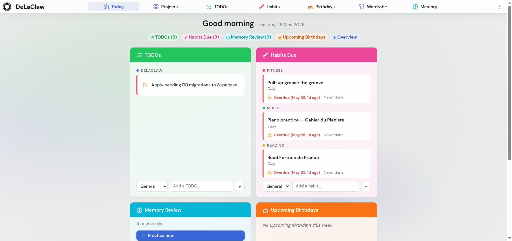
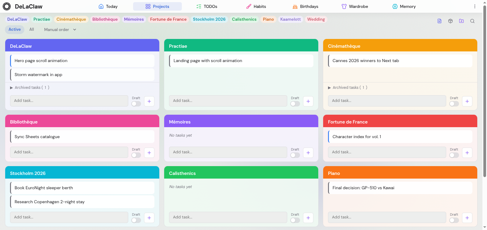

# DeLaClaw

A personal command center you own. No SaaS lock-in, no frameworks, bring your own backend.

[](https://github.com/AntGro/DeLaClaw/actions/workflows/test.yml)
[](LICENSE)
[](https://delaclaw.com)

<p align="center">
  
</p>

## What it does

DeLaClaw is a single-page productivity dashboard that runs entirely in the browser. It connects to your own database (Supabase, local SQLite, or an in-memory demo) and gives you a unified view of your projects, tasks, habits, flashcards, and more.

### Modules

| Module | Description |
|---|---|
| **Today** | Daily briefing: focus TODOs, due habits, flashcard reviews, upcoming birthdays, stats |
| **Projects** | Kanban-style project boards with task statuses, links, and drag-and-drop |
| **TODOs** | Categorized tasks with 5 priority levels, due dates, snooze, drag-and-drop reordering |
| **Habits** | Recurring habits with flexible scheduling (structured rules + free text), completion tracking, streaks |
| **Flashcards** | Spaced repetition (FSRS algorithm) with deck organization, text memorization mode, draft-to-card proposal workflow |
| **Birthdays** | Birthday tracker with countdowns and avatar support |
| **Wardrobe** | Clothing inventory with brand, size, category, and purchase status tracking |
| **Lists** | General-purpose checklists with archival support |

### Capabilities

- **Four backend modes**: Supabase (cloud PostgreSQL), Google Drive (per-table JSON files in your Drive), local REST server (Bun + SQLite), in-memory demo
- **Sharing**: Drive-backed group sharing for TODOs, habits, and lists — invite by email, multi-assignee completion, Google Picker for joining
- **Offline-first**: IndexedDB cache serves read-only data when the network is down, with automatic recovery
- **PWA**: installable on mobile and desktop via service worker with network-first caching
- **Dark and light themes** with automatic OS preference detection
- **Internationalization**: English, French, Spanish
- **Drag-and-drop** reordering across all list views
- **Keyboard shortcuts** for common actions
- **Zero frameworks**: vanilla JavaScript with ES modules (~17k lines, no build step)

## Screenshots

<p align="center">
  
</p>

## Quick start

DeLaClaw supports four backend modes. Pick one:

### Demo (no setup)

1. Open [delaclaw.com](https://delaclaw.com)
2. Click "Demo" and choose a dataset
3. All data lives in memory and resets on refresh

### Google Drive

1. Open [delaclaw.com](https://delaclaw.com)
2. Select "Drive" and click "Connect with Google"
3. Sign in with your Google account — DeLaClaw creates a `DeLaClaw/` folder in your Drive with one JSON file per table
4. All data syncs automatically; no API keys or database setup needed

### Supabase (cloud)

1. Create a [Supabase](https://supabase.com) project
2. Run the base schema and migrations in the SQL editor (see [Setup Guide](docs-site/setup.md))
3. Serve `index.html` with any static server, or use [delaclaw.com](https://delaclaw.com)
4. Select "Supabase", enter your project URL and anon key

### Local (Bun + SQLite)

1. Install [Bun](https://bun.sh)
2. Run the server:
   ```bash
   cd server
   bun run server.js
   ```
3. Open `http://localhost:3000` in a browser
4. Select "Local" and enter the server URL

See [docs-site/setup.md](docs-site/setup.md) for detailed instructions.

## Architecture

Single-page application with no build step. The browser loads ES modules directly.

```
index.html              Shell: login gate, tab navigation, all views
style.css               All styles (dark + light themes, responsive)
js/
  main.js               App bootstrap, view switching, settings, footer
  state.js              Centralized state and constants
  db.js                 Adapter abstraction with Proxy-based activity tracking
  adapters/
    supabase.js         Supabase PostgREST adapter
    rest.js             Local Bun+SQLite REST adapter
    demo.js             In-memory adapter with sample data
    drive.js            Google Drive adapter (in-memory + per-table JSON persistence)
    offline-cache.js    IndexedDB caching layer (wraps any adapter)
  sharing.js            Drive-based multi-user sharing (groups, items, Picker)
  sharing-ui.js         Sharing UI: settings pane, share popovers, completion modal
  welcome.js            Today dashboard
  projects.js           Project boards and task management
  todos.js              TODO management
  habits.js             Habit tracking
  flashcards.js         Flashcard SRS + text memorization
  birthdays.js          Birthday tracker
  vestiaire.js          Wardrobe inventory
  lists.js              Checklists
  i18n.js               Translation strings (en/fr/es)
  icons.js              Lucide icon rendering
  utils.js              Shared utilities
  item-utils.js         Drag-and-drop, inline editing
  hero.js               Landing page animations
  logo.js               Logo animation engine
  storm3d.js            Three.js hero effect
  version.js            Auto-generated version constant
  demo-chooser.js       Demo dataset selector
  demo-data.js          Sample data for demo mode
server/
  server.js             Bun HTTP server (SQLite backend)
  schema.sql            SQLite schema (16 tables)
migrations/             Incremental SQL migrations
sw.js                   Service worker (network-first + precache)
```

The adapter pattern (`db.js`) means the app logic never touches the backend directly. Each adapter exposes the same `.from(table).select()/.insert()/.update()/.delete()` interface. The offline cache wraps any adapter transparently, caching reads in IndexedDB and serving them when the network fails.

16 database tables: `projects`, `tasks`, `todos`, `habits`, `habit_completions`, `flashcards`, `flashcard_notes`, `texts`, `text_line_progress`, `birthdays`, `vestiaire`, `lists`, `list_items`, `settings`, `prompts`, `nvidia_usage`.

See [docs-site/architecture.md](docs-site/architecture.md) for details.

## Testing

```bash
node tests/tests.js
```

54 tests covering unit logic, adapter compliance, REST server integration, and browser-based end-to-end flows. All tests must pass before pushing to `main`.

## Contributing

See [Contributing](docs-site/contributing.md).

## License

[AGPL-3.0](LICENSE) — see [NOTICE](NOTICE) for attribution requirements.

DeLaClaw is free software. You can use, modify, and distribute it under the terms of the GNU Affero General Public License v3. If you run a modified version as a network service, you must make your source available to users of that service. Derivative works must credit DeLaClaw as described in the NOTICE file.

## Third-party

- [Lucide](https://lucide.dev) icons (ISC License)
- [DM Sans](https://fonts.google.com/specimen/DM+Sans) font (Open Font License)
- [Supabase JS](https://github.com/supabase/supabase-js) client (MIT License)
- [Three.js](https://threejs.org) for hero animations (MIT License)

See [Attributions](docs-site/attributions.md) for full details.
