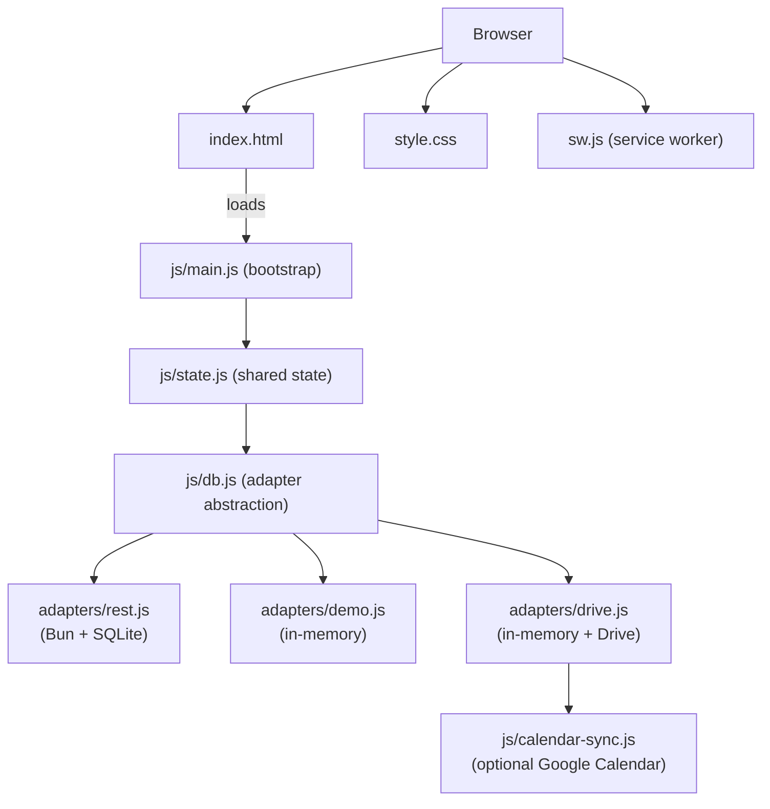

# Architecture

DeLaClaw is a single-page application with no build step. The browser loads vanilla JavaScript ES modules directly. All state lives in memory at runtime, backed by a pluggable database adapter.

## High-level overview



> The Supabase adapter (`adapters/supabase.js`) and its offline-cache wrapper (`adapters/offline-cache.js`) remain in the codebase for migration support but are not part of the active architecture. See the `dev-latest-supabase-support` branch for the pre-deprecation codebase.

## Adapter pattern

The app never talks to a backend directly. All database access goes through `db.js`, which delegates to the active adapter.

### db.js

A thin abstraction exposing:

- `db.from(table)` — returns a chainable query builder (select/insert/update/delete)
- `db.channel(name)` — real-time subscriptions (returns a no-op channel on all active backends)
- `db.rpc(fn, params)` — remote procedure calls (returns a no-op on all active backends)

Every call to `db.from()` wraps the result in a `tracked()` Proxy. This Proxy intercepts `.then()` to drive the activity indicator: the header logo spins while a query is in flight, and flashes red on error.

### Adapters

Each adapter implements the same interface:

| Method | REST | Demo | Drive |
|---|---|---|---|
| `from(table)` | HTTP `QueryBuilder` class | In-memory array filter | In-memory (delegates to demo engine) |
| `channel(name)` | No-op | No-op | No-op |
| `rpc(fn, params)` | HTTP POST | No-op | No-op |
| `bulkSortOrder(table, updates)` | Individual PATCHes | In-memory store mutation | Delegates to demo + schedules Drive save |

The chainable query builder supports: `.select()`, `.insert()`, `.update()`, `.delete()`, `.upsert()`, `.eq()`, `.neq()`, `.gt()`, `.gte()`, `.lt()`, `.lte()`, `.is()`, `.order()`, `.limit()`, `.single()`.

All adapters return `{ data, error }` objects. Successful queries return `{ data: [...], error: null }`.

### Google Drive adapter (drive.js)

Combines the demo adapter's in-memory query engine with Google Drive persistence. On connect, it authenticates via Google Identity Services (`drive.file` scope, plus optional `calendar.app.created` for [Calendar sync](sync-architecture.md)), finds or creates a `DeLaClaw/` folder, and loads per-table JSON files (e.g. `todos.json`, `habits.json`) into memory. All runtime queries hit the in-memory store (instant). On any mutation, a 2-second debounced write-back uploads the changed table to Drive as its own JSON file. The adapter exposes `forceSave()` for explicit flushes (called on `beforeunload` and `visibilitychange` → hidden), and `reseed()` for backup imports. A 30-second polling loop checks Drive for external changes; an immediate poll also fires on tab switch (`visibilitychange` → visible) and window focus. Legacy single-file stores (`delaclaw-data.json`) are automatically migrated to per-table files on first connect.

After a successful Drive flush, the optional Calendar sync module writes dirty items (habits, TODOs, birthdays) to a dedicated "DeLaClaw" Google Calendar. See [Sync Architecture](sync-architecture.md) for the full flow.

## State management

All shared state lives in `js/state.js` as a single exported `state` object:

```javascript
const state = {
  db,                        // db.js abstraction
  PROJECTS: [],              // project objects
  allTasks: [],              // task objects
  allHabits: [],             // habit objects
  allHabitCompletions: [],   // habit completion records
  allBirthdays: [],          // birthday objects
  allVestiaire: [],          // wardrobe items
  allLists: [],              // list objects
  allListItems: [],          // list item objects
  currentView: 'projects',   // active tab
  offlineMode: false,         // true when serving cached data
  pausedMode: false,          // true when sync is paused
  dbSchemaVersion: '0.000',   // from settings table
  sharing: null,              // sharing adapter instance
  authUser: null,             // authenticated user object
  tabVisibility: null,        // {key: bool} from settings DB
  tabOrder: null,             // [key, …] from settings DB
  archivedProjectIds: [],     // [id, …] from settings DB
  showArchived: false,        // bool from settings DB
  // ...
};
```

On login, all data is fetched sequentially (`refreshAll`, `refreshTodos`, `refreshHabits`, etc.) and stored in these arrays. Each module reads from and writes to the arrays, then calls its `render*()` function to update the DOM.

There is no virtual DOM, no reactivity system, and no framework state management. Each module owns its render function and re-renders its view in full when data changes.

## Database schema

The canonical table list lives in `server/schema.sql` (SQLite base schema). `sql/supabase_schema.sql` remains as a legacy reference.

| Table | Purpose | Key relationships |
|---|---|---|
| `projects` | Project metadata (name, color, links, sort order) | -- |
| `tasks` | Tasks within projects | `project` -> `projects.id` |
| `todos` | Standalone TODOs with priority and due dates | `category_id` -> `todo_categories.id` |
| `todo_categories` | TODO category containers | -- |
| `habits` | Habit definitions with scheduling rules | `category_id` -> `habit_categories.id` |
| `habit_categories` | Habit category containers | -- |
| `habit_completions` | Completion log for habits | `habit_id` -> `habits.id` |
| `flashcards` | SRS flashcards with FSRS scheduling data | `deck_id` -> `flashcard_decks.id` |
| `flashcard_decks` | Flashcard deck containers | -- |
| `flashcard_notes` | Draft notes with AI proposal workflow | -- |
| `texts` | Full texts for memorization (chunked) | -- |
| `text_line_progress` | Per-chunk SRS progress for texts | `text_id` -> `texts.id` |
| `birthdays` | Birthday records with optional avatars | -- |
| `vestiaire` | Wardrobe inventory | `category_id` -> `vestiaire_categories.id` |
| `vestiaire_categories` | Wardrobe category containers | -- |
| `lists` | Checklist containers | -- |
| `list_items` | Items within lists | `list_id` -> `lists.id` |
| `settings` | Key-value store (schema version, preferences) | -- |
| `prompts` | AI prompt templates | -- |
| `nvidia_usage` | API token usage tracking | -- |
| `daily_visits` | Login/visit tracking | -- |
| `joined_groups` | Groups the user has joined (encrypted tokens) | -- |
| `agent_grants` | AI agent permission grants | -- |
| `sharing_groups` | Shared group definitions | -- |
| `sharing_members` | Group membership | `group_id` -> `sharing_groups.id` |
| `sharing_items` | Shared items (TODOs, habits, list items) | `group_id` -> `sharing_groups.id` |

### Category integrity

Each category/deck table has one protected default row (`name=''`, `is_protected=1`). A `protect_category_row()` trigger prevents DELETE/UPDATE on protected rows. Item foreign keys (`category_id` / `deck_id`) use **CASCADE** on delete — deleting a user-created category deletes all its items. App-level sharing cleanup runs before CASCADE to propagate shared-item deletion to group members.

### CHECK constraints

CHECK constraints are enforced at the database level:
- `tasks.status`: `todo`, `in-progress`, `review`, `approved`, `revision`
- `todos.priority`: `urgent`, `high`, `medium`, `low`, `normal`
- `flashcard_notes.proposal_status`: `pending`, `ready`, `accepted`, `rejected`

The demo adapter mirrors these constraints in JavaScript.

## Service worker

`sw.js` implements a **network-first** strategy for all requests:

1. Try the network
2. On success: cache the response and serve it
3. On failure: serve from the SW precache

The precache (`PRECACHE_URLS`) includes all static assets. The `CACHE_VERSION` string is updated automatically by the pre-commit hook from the `VERSION` file (format: `dlc-X.Y.Z`).

On install, the SW calls `skipWaiting()`. On activate, it purges old caches and calls `clients.claim()`. The page listens for `controllerchange` events and reloads automatically when a new SW takes over.

## Version management

The `VERSION` file at the repo root is the single source of truth:

```
latest=1.016
latest_compat=1.000
latest_compat_deprec=1.000
```

The pre-commit hook (`.githooks/pre-commit`):
1. Verifies `VERSION` is staged and `latest` has increased
2. Validates the `latest_compat_deprec <= latest_compat <= latest` invariant
3. Regenerates `js/version.js` with exported constants
4. Updates `CACHE_VERSION` in `sw.js`
5. Regenerates `.agents/CODEMAP.json` and `.agents/CODEMAP.md` from source
6. Stages all generated files
7. Prints an impact hint from CODEMAP `dependents` to help fill the `Checked:` trailer

Schema version is stored in the `settings` table (`key = 'schema_version'`). The app compares it against `latest_compat` and `latest_compat_deprec` at startup, showing a warning banner if the database is behind.

## File structure

```
index.html                 Single-page shell (login gate + all views)
style.css                  All styles (dark + light themes, responsive)
sw.js                      Service worker
manifest.json              PWA manifest
VERSION                    Version source of truth
CNAME                      GitHub Pages custom domain

js/
  main.js                  Bootstrap, view switching, settings, login, footer
  state.js                 Shared state object
  db.js                    Adapter abstraction with activity tracking
  version.js               Auto-generated version constants
  calendar-sync.js         Google Calendar sync (Drive backend, optional)
  adapters/
    supabase.js            Supabase PostgREST adapter (legacy, migration support)
    rest.js                Local Bun+SQLite REST adapter
    demo.js                In-memory adapter
    drive.js               Google Drive adapter (in-memory + per-table JSON persistence)
    offline-cache.js       IndexedDB caching layer (legacy, Supabase-only)
  auth.js                  Supabase email auth (legacy, migration support)
  crypto-sync.js           AES-GCM encryption for joined_groups tokens (legacy, Supabase-only)
  sharing.js               Sharing factory (selects Supabase or Drive adapter)
  sharing-interface.js     Sharing adapter interface contract
  sharing-supabase.js      Supabase sharing adapter (legacy, RPC-based)
  sharing-drive.js         Google Drive sharing adapter (per-table JSON)
  sharing-envelope.js      DLC1 invite-code encode/decode
  sharing-ui.js            Sharing UI: settings pane, share popovers, completion modal
  delegation.js            Cross-module action delegation for shared items
  welcome.js               Today dashboard
  projects.js              Project boards + task management
  todos.js                 TODO management
  habits.js                Habit tracking
  flashcards.js            Flashcard SRS + text memorization
  birthdays.js             Birthday tracker
  vestiaire.js             Wardrobe inventory
  lists.js                 Checklists
  agents-ui.js             Agent task board UI
  i18n.js                  Translation strings (en/fr/es)
  icons.js                 Lucide icon rendering + path data
  utils.js                 Shared utilities (escaping, toasts, markdown)
  item-utils.js            Drag-and-drop, inline editing, hover actions
  backend-logos.js         Backend picker logo SVGs
  hero.js                  Landing page animations
  logo.js                  Logo animation engine
  storm3d.js               Three.js hero particle effect
  demo-chooser.js          Demo dataset selector UI
  demo-data.js             Sample data for demo mode
  bootstrap.js             ES module loader (extracted from inline script)
  sw-register.js           Service worker registration

server/
  server.js                Bun HTTP server (PostgREST-compatible API)
  schema.sql               SQLite base schema

migrations/                Incremental schema migrations
tests/
  tests.js                 Unit + adapter + integration + guard tests
icons/
  brand/                   Self-hosted brand SVGs (thesvg.org + dashboard-icons)
.agents/
  CODEMAP.json             Auto-generated dependency index (see AGENTS.md §1.4)
  CODEMAP.md               Human-readable matrix summary
  contracts/               Feature contracts (business invariants per feature)
.githooks/
  pre-commit               VERSION enforcement + CODEMAP regeneration + impact hint
```

## Internationalization

`js/i18n.js` exports a `t(key)` function that returns the translated string for the active language. All UI text goes through `t()`. Currently supported: English, French, Spanish.

Language is stored in `localStorage` and can be changed in Settings. The `t()` function falls back to English if a key is missing in the active language.

## Drag-and-drop

`js/item-utils.js` provides reusable drag-and-drop reordering via long-press (100ms threshold). Both category nav buttons and bucket items (TODOs, Projects, Vestiaire, Lists, Flashcard drafts) share the same UX:

- **Activation**: long-press on touch/pointer (`LONG_PRESS_MS = 100`), not native HTML drag events
- **Visual**: the real item follows the cursor/finger; a placeholder gap shows the drop position; siblings slide with FLIP animation. No visible drag handles — shadow-only to indicate float
- **Cross-container**: TODOs, Vestiaire, Projects, Habits, and Lists support dragging items between categories/lists — drop updates the FK and re-numbers `sort_order` in both source and target containers
- **Persistence**: `sort_order` updates are batched into a single DB write
- **Auto-scroll**: scrollable containers auto-scroll when dragging near edges
