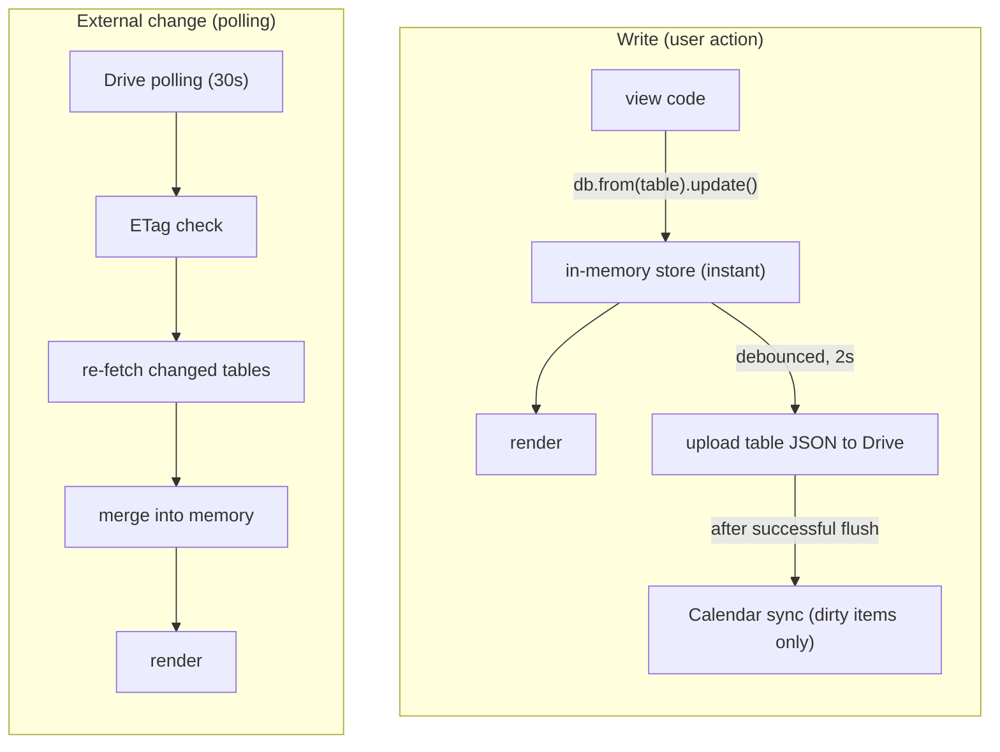
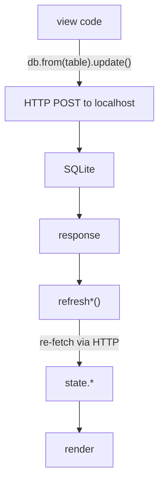

# BACKENDS.md — Backend Architecture & Protocol

DeLaClaw supports three backend adapters. This document is the single source of truth for how they work, how they differ, and how to maintain them.

---

## 1. Overview

| Backend | Storage | Auth | Sync | Offline | Agent support |
|---------|---------|------|------|---------|---------------|
| **Google Drive** | Per-table JSON files | OAuth 2.0 | 30s polling (single-user) | In-memory only | ✅ Via per-table JSON (see §8) |
| **Local** | SQLite (Bun server) | None | None (single-device) | N/A (is local) | ⚠️ Possible via REST |
| **Demo** | In-memory | None | None | N/A | ❌ |

> **Supabase backend support has been removed.** The Supabase adapter and client library remain in the codebase temporarily to support migration to Google Drive. The pre-deprecation codebase is preserved on the `dev-latest-supabase-support` branch.

---

## 2. Adapter Contract

Every adapter must expose this interface:

```js
{
  from(table)              → QueryBuilder   // chainable: .select() .eq() .insert() .update() .delete() .order() .limit() .single()
  channel(name)            → Channel        // { .on().subscribe() } or NoopChannel
  rpc(fn, params)          → Promise<{data, error}>
  bulkSortOrder(table, updates) → Promise   // batch-update sort_order; each adapter implements natively
}
```

### QueryBuilder return shape

All terminal methods (`.select()`, `.insert()`, `.update()`, `.delete()`, `.upsert()`) return:

```js
{ data: Array|Object|null, error: { message: string }|null }
```

### NoopChannel

Adapters without real-time support return a `NoopChannel`:

```js
{ on() { return this; }, subscribe() { return this; }, unsubscribe() { return this; } }
```

### Adding a new adapter

1. Implement the interface above
2. Add the backend option to `index.html` (picker button)
3. Wire it in `js/main.js` `connectAndInit()`
4. Add its CHECK constraints (or reuse the demo adapter — see §4)
5. Update this document's feature matrix
6. Add a CRUD smoke test (see §12)

---

## 3. Schema & Single Source of Truth

### The problem

Three adapters, two schema definitions:
- `server/schema.sql` — SQLite DDL (Local)
- `js/adapters/demo.js` — `CHECK_CONSTRAINTS` object (Demo + Drive)

These **must stay in sync**. The `draft` status bug (v1.105) was caused by the demo adapter missing statuses that existed in the SQL schema.

`sql/supabase_schema.sql` remains in the repo as a legacy reference but is no longer canonical for active backends.

### Rules

1. **`server/schema.sql` is canonical.** It defines every table, column, default, and CHECK constraint for active backends.
2. **`js/adapters/demo.js` `CHECK_CONSTRAINTS`** must match the SQL CHECK constraints exactly. Test 31 enforces this automatically.
3. **Drive adapter** reuses the demo adapter's `DemoQueryBuilder` — no separate schema needed.

### Column defaults

| Column | SQLite | Demo adapter |
|--------|--------|--------------|
| `id` | `TEXT PRIMARY KEY` (app-generated) | `uid()` (crypto.randomUUID) |
| `created_at` | `datetime('now')` | `new Date().toISOString()` |
| `updated_at` | `datetime('now')` | `new Date().toISOString()` |
| `status` (tasks) | CHECK constraint | `CHECK_CONSTRAINTS` |

---

## 4. Per-Backend Details

|  | **Google Drive** | **Local (Bun + SQLite)** | **Demo** |
|---|---|---|---|
| **Adapter** | `drive.js` — wraps the demo adapter with per-table Drive persistence, ETag-based conflict resolution, and polling for external changes | `rest.js` — plain HTTP client with chainable PostgREST-like API | `demo.js` — full in-memory query builder with CHECK constraints |
| **Architecture** | Stores one JSON file per table in a `DeLaClaw/` Drive folder. Reads/writes hit in-memory store (instant). Debounced per-table write-back flushes to Drive after 2s of inactivity. Polls Drive every 30s for external changes | `server/server.js` — Bun REST server + static file server. SQLite schema applied on startup via `CREATE TABLE IF NOT EXISTS` | Seeded with localized sample data from `demo-data.js` (EN/FR/ES). All operations run against in-memory JS objects. Nothing persists across refresh |
| **Auth** | Google OAuth 2.0 via Google Identity Services. Scope: `drive.file` (only files created by the app) + optional `calendar.app.created` (only calendars created by the app, for [Calendar sync](sync-architecture.md)). "Stay connected" triggers silent re-auth on reload (`prompt: ''`); clears credentials on failure | None. ⚠️ Server binds to `0.0.0.0` by default, exposing the API to the local network | None |
| **Session** | Token in memory. "Stay connected" saves client ID to localStorage | N/A | N/A |
| **Sync** | Polls Drive every 30s via `files.list` — re-fetches only tables whose `modifiedTime` changed. Skips locally-dirty tables. External change callback available for UI refresh. Immediate poll also fires on tab focus / `visibilitychange` → visible | None. Single-server, single-device | N/A |
| **Offline** | None. Initial Drive fetch failure → connect fails. Mid-session flush failure → changes lost on reload | N/A — data is local. Server process dying → connection errors | N/A |
| **Agent support** | ✅ Agent reads/writes individual per-table JSON files via Drive API. Concurrent edits on different tables can't conflict. Same-table conflicts resolved via ETag optimistic locking (412 → merge by id, newer `updated_at` wins) | ⚠️ Possible in theory — REST API matches PostgREST shape. Not currently wired | ❌ N/A |
| **Storage limits** | Free tier: 15 GB shared across Gmail/Drive/Photos. DeLaClaw JSON typically < 1 MB | SQLite limit: ~281 TB. Effectively unlimited | N/A |
| **Security** | Inherits Google account security. `drive.file` scope → no access to user's other Drive files. `calendar.app.created` scope → no access to user's other calendars | No auth, no encryption at rest. Trusted local networks only. **TODO:** bind to `127.0.0.1`; add optional auth token | N/A |
| **Setup** | Click "Connect with Google" → authorize → folder and data file created automatically | `cd server && bun run server.js`. Enter `http://localhost:3737` in login form | Click "Demo" on login screen, choose a sample dataset or start empty |
| **Purpose** | Primary persistent backend — no database, no API keys, just a Google account. Optional Calendar sync projects habits, TODOs, and birthdays to a dedicated Google Calendar | Self-hosted option for privacy-conscious users on trusted networks | Try DeLaClaw without any backend. Also serves as the Drive adapter's query engine |

---

## 4b. Data Flow

The read/write/sync paths differ between backends:

### Google Drive — local-first



All reads and writes hit the in-memory store immediately. The Drive adapter delegates to the
demo engine for query execution. Mutations mark the table dirty; a 2-second debounce per table
uploads the JSON file to Drive. Conflict resolution uses ETags (412 → re-read, merge by
`updated_at`, retry). `forceSave()` flushes on `beforeunload` / `visibilitychange`.

After a successful Drive flush, the Calendar sync module writes dirty items (habits, TODOs, birthdays) to the dedicated Google Calendar. For the full Drive + Calendar sync flow including dirty tracking and debounce, see [Sync Architecture](sync-architecture.md).

### Demo — ephemeral in-memory

```
WRITE (user action)
  view code ──► db.from(table).update() ──► in-memory store (instant) ──► render

No persistence, no sync. Data resets on page reload.
```

### Local (Bun + SQLite) — backend-first



No realtime. Single-user, single-device.

---

## 5. Migrations

See `migrations/MIGRATION_GUIDE.md` for the full protocol. Key points:

- **Single version number** shared between app (`VERSION` file) and DB (`settings.schema_version`).
- **Migration files** named `<version>_<description>.sql` (e.g., `1.099_enable_realtime.sql`).
- **Pre-commit hook** blocks commits without a VERSION bump; auto-generates `js/version.js`.

### Dev / prod workflow

| Branch | Deploys to |
|--------|------------|
| `dev` | `dev.delaclaw.pages.dev` |
| `main` | `delaclaw.com` |

1. Write migration on feature branch
2. Test on `dev`, verify on preview
3. Merge to `main` when stable

### Backend-specific notes

- **Local:** `server/schema.sql` uses `CREATE TABLE IF NOT EXISTS` — new columns require a migration or DB reset. Auto-migration on server start is possible but not implemented.
- **Drive / Demo:** Schema is implicit (in-memory objects). New columns just appear as `undefined` in old data — the app should handle missing fields gracefully.

---

## 6. Offline Behavior

### Google Drive

No offline support. If the network drops mid-session, in-memory state is preserved until the tab closes, but flushes to Drive will fail.

### Local

N/A — the server and client are on the same machine (or local network).

### Demo

N/A — everything is in-memory.

### Future consideration

A write queue (store pending writes in IndexedDB, replay on reconnect) would make Drive usable in flaky-network scenarios.

---

## 7. Cross-Device Sync

No active backend supports cross-device sync. Drive, Local, and Demo are effectively single-device.

### Conflict resolution

Drive uses ETag-based optimistic locking for agent-vs-app conflicts (412 → re-read, merge by `updated_at`, retry). For concurrent same-user edits across devices, last write wins.

---

## 8. Agent Integration

The agent interacts with DeLaClaw via the Google Drive API, reading and writing individual per-table JSON files in the `DeLaClaw/` Drive folder.

### Current capabilities

- **Task pickup:** Heartbeat fetches `status=todo` and `status=revision` tasks, works on them, sets `status=review` with `hatch_response`.
- **Flashcard proposals:** Heartbeat fetches `proposal_status=pending` drafts, generates Q/A pairs, sets `proposal_status=ready`.
- **Habit `next_due`:** Heartbeat computes `next_due` for free-text frequency rules.
- **Prompts:** Reads global + per-project prompts from the `prompts` table for task context.

### Conflict handling

- **Per-table granularity** — the agent reads/writes only the table it needs (e.g., `tasks.json`), without touching others.
- **ETag-based conflict resolution** — writes include an `If-Match` header. If the app flushed the same table since the agent's read, the write fails with 412 and the agent re-reads, merges (newer `updated_at` wins per record), and retries.
- **Polling for changes** — the app polls Drive every 30s and re-fetches tables whose `modifiedTime` changed, so agent edits show up without a full reload.

### Other backends

**Local:** The agent could in theory hit the REST API (same shape as PostgREST), but has no way to reach the user's local server unless it's exposed via a tunnel.

**Demo:** N/A — ephemeral in-memory data.

---

## 9. Storage & Quotas

### Reporting

**Current:** No storage reporting in the app.

**Planned:** A "Storage" section in Settings showing:
- Row count per table
- Estimated total size
- Backend-specific limits and usage percentage

### Limits by backend

| Backend | Limit | What counts |
|---------|-------|-------------|
| Drive free | 15 GB shared | Per-table JSON files (typically < 1 MB total) |
| Local SQLite | Disk space | Single `.db` file |
| Demo | Browser memory | Ephemeral |

---

## 10. Backup & Restore

### Export

`generateBackupJSON()` in `js/main.js` reads all tables in `BACKUP_TABLES` order and produces a JSON file:

```json
{
  "_meta": { "version": 1, "exported_at": "...", "tables": [...] },
  "projects": [...],
  "tasks": [...],
  ...
}
```

**Export options:**
- **Download:** Browser download as `.json` file.
- **Push to Drive:** Available when connected to Drive backend. Saves backup as a separate file in the `DeLaClaw/` folder.

### Import

`importBackupJSON()` reads a backup file and upserts all rows into the current backend. Import order follows `BACKUP_TABLES` (parent tables first for FK integrity).

### Backend migration (data portability)

To move data between backends:
1. Connect to source backend
2. Export backup JSON
3. Connect to target backend (fresh schema)
4. Import backup JSON

**Limitation:** Backend-specific features don't transfer. Only data moves.

### Automated backups (future)

Options:
- **Scheduled export:** Cron job that runs `generateBackupJSON()` and pushes to Drive or local disk.

---

## 11. Security Model

| Aspect | Drive | Local | Demo |
|--------|-------|-------|------|
| Auth | Google OAuth | None | None |
| Encryption in transit | HTTPS | HTTP (localhost) | N/A |
| Encryption at rest | Google-managed | None | N/A |
| Access control | `drive.file` + optional `calendar.app.created` scopes | None — **open API** | N/A |

### Known risks

1. **Local server on `0.0.0.0`:** Exposes the full API to the local network. Should default to `127.0.0.1`.
2. **No HTTPS on local:** Data travels in plaintext on localhost. Fine for `127.0.0.1`; risky if bound to a network interface.
3. **Drive token scope:** mitigated — tokens scoped by clientId and dedup promise since sec-003.

### Hardening roadmap

- [ ] Local server: bind to `127.0.0.1` by default, optional `--host` flag
- [ ] Local server: optional bearer token auth

---

## 12. Testing Strategy

### Static tests (every commit)

- **CHECK constraint parity test.** Verifies `demo.js CHECK_CONSTRAINTS` match the SQL CHECK constraints. Catches drift between adapters.

### Integration tests (Playwright + local Bun server)

- **Archive + delete flow:** Creates projects, archives one, deletes it, verifies remaining cards render.
- **TODO priority flow:** Tests priority levels across the full lifecycle.
- **Flashcard import flow:** Tests import with existing/new decks, zero-deck edge case.

### Missing test coverage

- [ ] **CRUD smoke test per adapter:** Insert, select, update, delete across all adapters. Currently only tested implicitly through the local Bun server.
- [ ] **Offline cache test:** Simulate network failure, verify cached data is returned, verify write fails gracefully.
- [ ] **Drive flush test:** Verify debounced write-back to Drive after mutation.
- [ ] **Schema parity test for SQLite:** Verify `server/schema.sql` matches demo adapter CHECK constraints (table names, column names, CHECK constraints).

---

## 13. Setup

See the [Setup Guide](setup.md) for step-by-step instructions for each backend.

---

## Appendix: Table Inventory

Tables tracked in `BACKUP_TABLES` (import order):

| Table | Purpose | FK dependencies |
|-------|---------|-----------------|
| `todo_categories` | TODO category containers | — |
| `habit_categories` | Habit category containers | — |
| `vestiaire_categories` | Wardrobe category containers | — |
| `flashcard_decks` | Flashcard deck containers | — |
| `projects` | Project cards | — |
| `habits` | Habit definitions | — |
| `texts` | Long-form texts | — |
| `lists` | User-created lists | — |
| `todos` | TODO items | `todo_categories.id` |
| `tasks` | Project tasks | `projects.id` |
| `habit_completions` | Habit check-ins | `habits.id` |
| `flashcards` | Flashcard Q/A pairs | `flashcard_decks.id` |
| `flashcard_notes` | Draft flashcard proposals | — |
| `text_line_progress` | Reading progress per line | `texts.id` |
| `birthdays` | Birthday tracker | — |
| `vestiaire` | Wardrobe items | `vestiaire_categories.id` |
| `list_items` | Items within lists | `lists.id` |
| `settings` | App settings (key/value) | — |
| `prompts` | AI prompts (global + per-project) | — |
| `nvidia_usage` | LLM API usage tracking | — |
| `daily_visits` | Daily visit log | — |
| `sharing_groups` | Shared group definitions | — |
| `sharing_members` | Group membership | `sharing_groups.id` |
| `sharing_items` | Shared items (TODOs, habits, list items) | `sharing_groups.id` |
| `joined_groups` | Groups the user has joined | — |
| `agent_grants` | AI agent permission grants | — |
