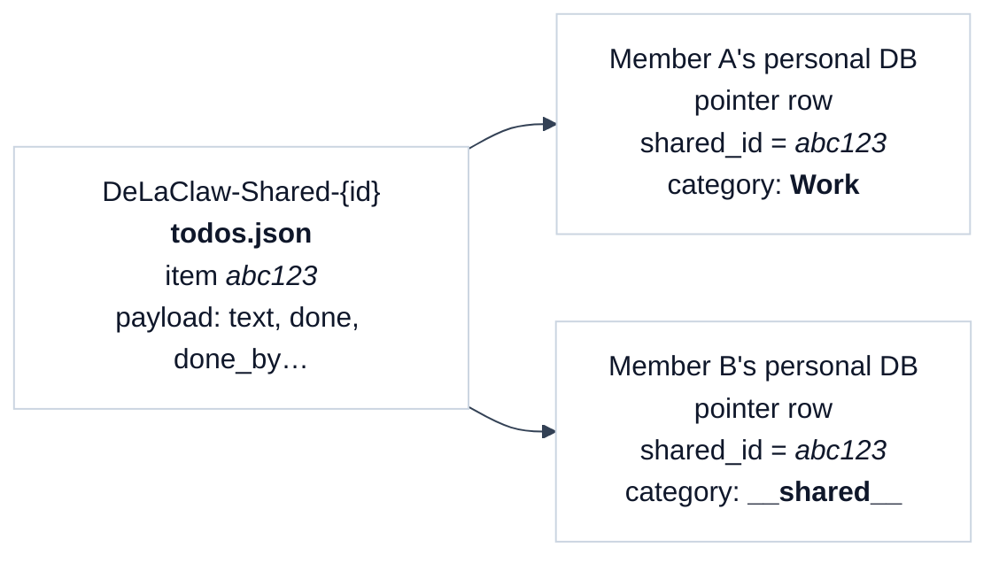
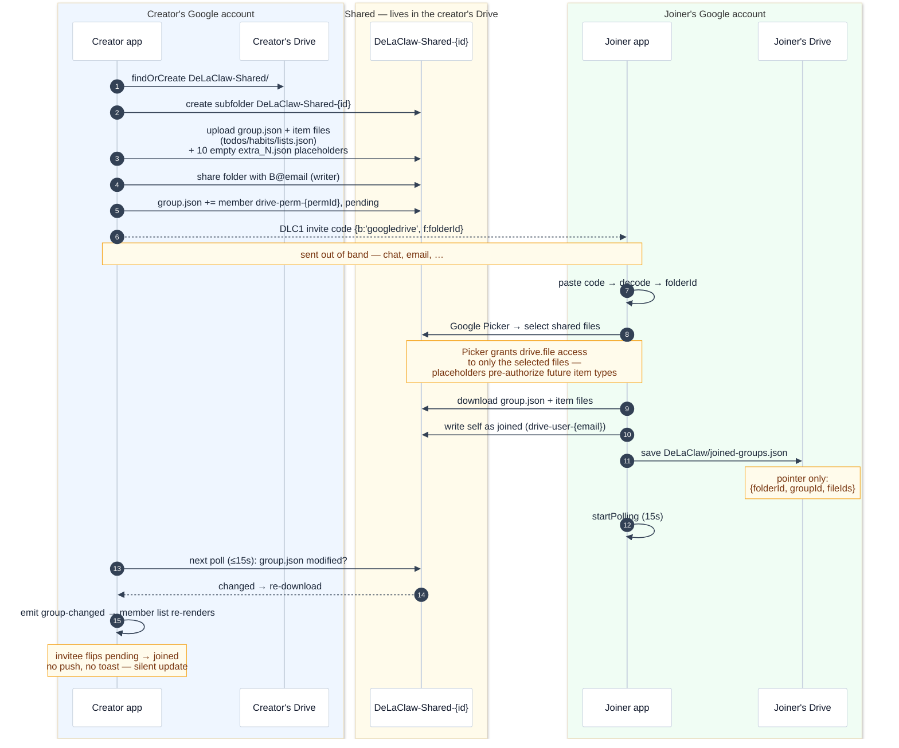
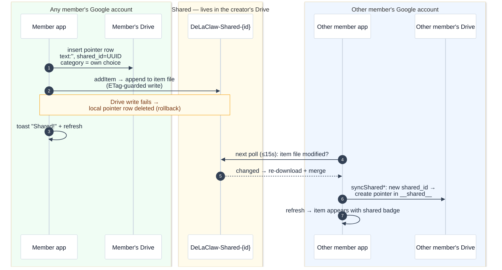
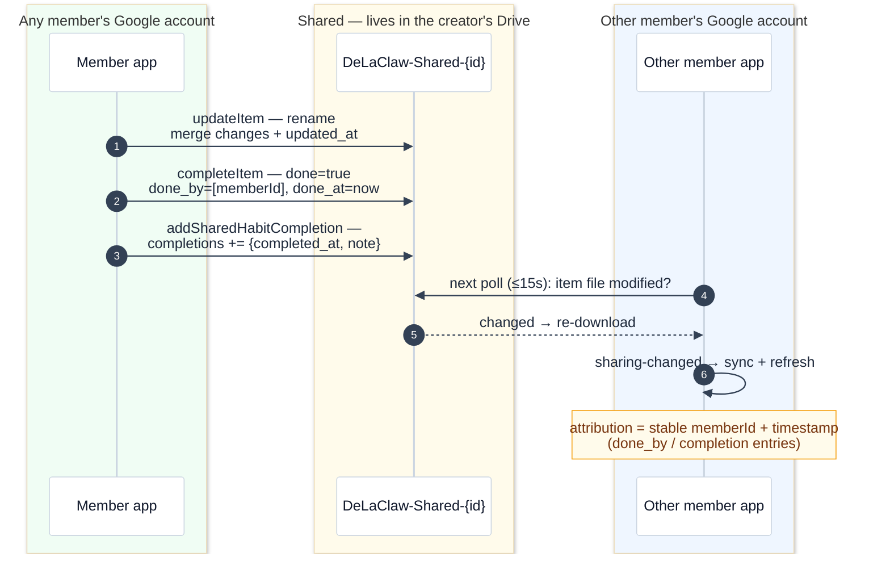
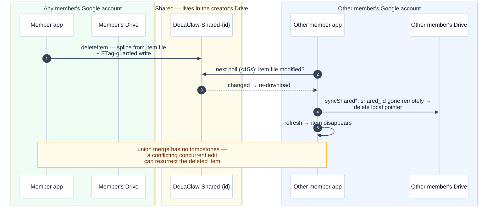
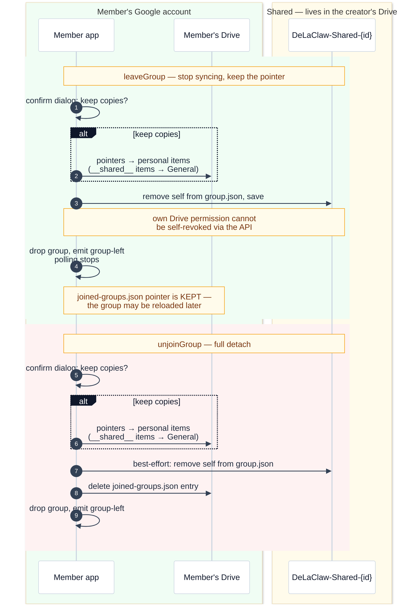
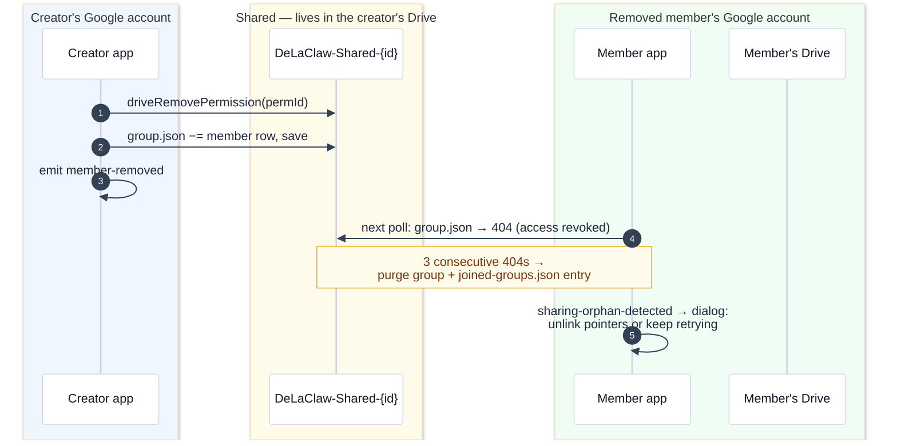
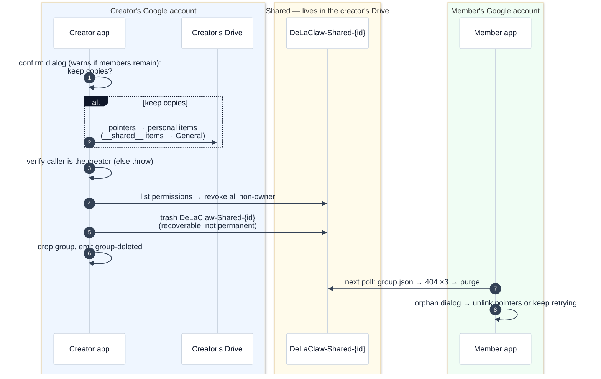

# Sharing

Last updated: 2026-09-07

DeLaClaw lets you share TODOs, habits, and list items with other people through sharing groups. This page explains the architecture, data flow, and security model.

## Overview

Sharing is **decentralized**: there is no central DeLaClaw server. One user (the **owner**) hosts the shared data on their own backend, and other users (**members**) connect to it via invite codes. The owner's project is the single source of truth for all group data.

```
┌──────────────────────────────────────────────────┐
│                  Sharing group                   │
│                                                  │
│  Owner (A)              Member (B)               │
│  ┌──────────┐           ┌──────────┐             │
│  │ Personal │           │ Personal │             │
│  │  tables  │           │  tables  │             │
│  │  (RLS)   │           │  (own DB)│             │
│  └────┬─────┘           └────┬─────┘             │
│       │                      │                   │
│       │  direct file         │  shared folder    │
│       ▼  read/write          ▼  read/write       │
│  ┌─────────────────────────────────────────┐     │
│  │         Owner's Drive folder            │     │
│  │                                         │     │
│  │  shared/<group>/meta.json (definitions) │     │
│  │  shared/<group>/items.json (shared      │     │
│  │    TODOs/habits/list items)             │     │
│  └─────────────────────────────────────────┘     │
└──────────────────────────────────────────────────┘
```

## Concepts

**Group** — a named container that the owner creates. Each group has its own members, items, and invite codes.

**Invite code** — an opaque `DLC1.` prefixed string that encodes everything a joiner needs: the backend type, the shared folder ID, the group ID, and an optional expiry. Access control comes from Google Drive folder permissions plus a local trusted-contacts allowlist.

**Local pointer** — when a shared item is displayed on a member's device, a minimal row exists in their local database (e.g. a `todos` row with `shared_id` + `shared_group_id` but empty `text`). The real content comes from the owner's `sharing_items` table at sync time.

**Shared category (`__shared__`)** — items received from others land in a protected `__shared__` category/list on the receiver's side. Items you share yourself stay in their current category.

## Backend-agnostic design

All sharing logic goes through an adapter interface (`sharing-interface.js`). Views (`todos.js`, `habits.js`, `lists.js`) never talk directly to a backend — they call `state.sharing.addItem()`, `state.sharing.leaveGroup()`, etc.

```
┌──────────────────────────┐
│     Feature views        │
│  todos · habits · lists  │
└───────────┬──────────────┘
            │  state.sharing.*
            ▼
┌──────────────────────────┐
│   Sharing interface      │
│   (canonical contract)   │
└───────────┬──────────────┘
            │
            ▼
     ┌────────────┐
     │   Drive    │
     │  adapter   │
     └────────────┘
```

The adapter is validated at init time against the interface contract — a missing method is a hard error, not a silent runtime crash. The Supabase sharing adapter was removed with the Supabase backend; Drive is the only sharing path.

## Supabase ↔ Supabase (removed)

The Supabase sharing adapter (`sharing-supabase.js`) was removed together with the Supabase backend. The pre-deprecation codebase is preserved on the `dev-latest-supabase-support` branch.

## Drive ↔ Drive

The Google Drive sharing adapter is the only sharing path. Drive sharing has no server: the shared state is a folder in the **creator's** Google Drive, and every member reads and writes the same files through the Drive API. The joiner's own Drive only ever holds a pointer (`joined-groups.json`) with the shared folder's file IDs. Access control is enforced by Drive folder permissions plus a local trusted-contacts allowlist.

### Storage layout

```
Creator's Drive                                Joiner's Drive
───────────────                                ──────────────
My Drive/                                      My Drive/
├── DeLaClaw/                  (personal)      ├── DeLaClaw/                  (personal)
│   ├── todos.json                             │   ├── todos.json
│   ├── habits.json                            │   ├── habits.json
│   ├── lists.json                             │   ├── lists.json
│   └── joined-groups.json                     │   └── joined-groups.json  ◄── pointer only
│                                                  {folderId, groupId, fileIds}
└── DeLaClaw-Shared/           (shared root)
    └── DeLaClaw-Shared-{groupId}/
        ├── group.json         ← members, creator, name
        ├── todos.json         ← item files (one per type)
        ├── habits.json
        ├── lists.json
        └── extra_1..10.json   ← empty placeholders, pre-authorize
                                  future item types (avoids sending every
                                  member back through the Drive Picker)
```

- **Invite code**: `DLC1.<base64url({v:1, b:'googledrive', f:<folderId>})>` — one group-level code, no per-member tokens.
- **Access control**: Drive folder permissions (writer) plus the trusted-contacts allowlist; `group.json` holds the member list. No RPC layer, no token hashing.
- **Sync**: every member polls every 15 s, keyed on each file's `modifiedTime`. Concurrent writes use ETags with up to two conflict retries; the merge is last-write-wins by union of item IDs.
- **Drive scopes**: with `drive.file` scope the joiner grants access through the Google Picker (only the selected files); with full `drive` scope the folder is listed directly.

### Local pointers and per-member buckets

Shared items do **not** force the same buckets on every member. Each member's personal database holds a **pointer row** per shared item (`shared_id` + `shared_group_id`, with empty `text`/`name`); the live content is overlaid from the group's item files at render time.

- Items **you** share stay in your current category with a shared badge.
- Items **received** from others land in the protected `__shared__` category — and like any other row, the pointer can then be moved into one of your own categories.
- Ordering (`sort_order`) is per-member and never synced.
- When a shared item disappears remotely, the next sync deletes the local pointer; when a whole group disappears, a confirmation dialog offers to unlink the pointers or keep retrying.



### Lifecycle

#### Invite → join



Join awareness is passive: the joiner's write to `group.json` bumps its `modifiedTime`; the creator's next poll (≤ 15 s) re-downloads it and the member list re-renders with the invitee flipped from pending to joined.

#### Create an item (creator and member)

The flow is identical for creator and member — shared items are collaboratively editable: any group member can add, update, or delete any item.



#### Modify an item (rename, mark done, habit completion)



#### Delete an item



#### Member leaves / unjoins



#### Creator removes a member



#### Creator deletes a group



#### Member deletes their DeLaClaw account connection (deleteAccount)

This is DeLaClaw's Drive-backed `deleteAccount` (trash the personal
`DeLaClaw/` folder, revoke OAuth), not deletion of the Google account itself —
that case is an open question (see the “Drive sharing” tab in the design
decisions space).

```mermaid
%%{init: {'theme': 'base', 'themeVariables': {'background': '#fbfaf8', 'actorBkg': '#ffffff', 'actorBorder': '#cbd5e1', 'actorTextColor': '#0f172a', 'actorLineColor': '#cbd5e1', 'signalColor': '#334155', 'signalTextColor': '#1e293b', 'noteBkgColor': '#fffbeb', 'noteBorderColor': '#f59e0b', 'noteTextColor': '#78350f', 'labelBoxBkgColor': '#0f172a', 'labelBoxBorderColor': '#0f172a', 'labelTextColor': '#ffffff'}}}%%
sequenceDiagram
    autonumber
    box rgb(240,253,244) Member's Google account
    participant MA as Member app
    participant MD as Member's Drive
    end
    box rgb(255,251,235) Shared — lives in the creator's Drive
    participant SF as DeLaClaw-Shared-{id}
    end

    MA->>MD: deleteAccount: trash personal<br/>DeLaClaw/ folder
    MA->>MA: revoke OAuth token
    Note over MD,SF: DeLaClaw-Shared/ lives at Drive root —<br/>it is NOT trashed; groups the member<br/>created survive with a ghost creator
    Note over SF: no leave/unjoin is performed —<br/>member rows stay in group.json (ghost members)
    Note over MA,SF: other members get no signal —<br/>the creator must removeUser manually
```

### Open design questions

Drawing these flows surfaced gaps and undecided behaviors. They are collected as a tab in the **DeLaClaw design decisions** space ("Drive sharing" tab): join notification, deletion tombstones, leave vs unjoin semantics, raw emails in member IDs, open-join admission, ghost creator IDs after removal, creator-only invite/remove enforcement, account-deletion cleanup, externally deleted accounts, placeholder exhaustion, receiver placement, and keep-vs-retry on remote deletion.


## Module structure

| Module | Role |
|---|---|
| `sharing-interface.js` | Canonical method contract; validated at init |
| `sharing-envelope.js` | Invite code encode/decode (`DLC1.<base64url>`) |
| `sharing-drive.js` | Drive adapter (maintenance mode) |
| `sharing-ui.js` | Settings pane, share popovers, badges, join flow |
| `sharing.js` | Factory that picks adapter by backend mode |
| `crypto-sync.js` | AES-GCM encryption for joined-group credentials |

## Related

- [ADR 0005 — Sharing behind adapter interface](adrs/0005-sharing-behind-adapter-interface.md)
- [Setup Guide](setup.md)
- [Privacy — Google Drive scopes and data exchange](privacy.md)
