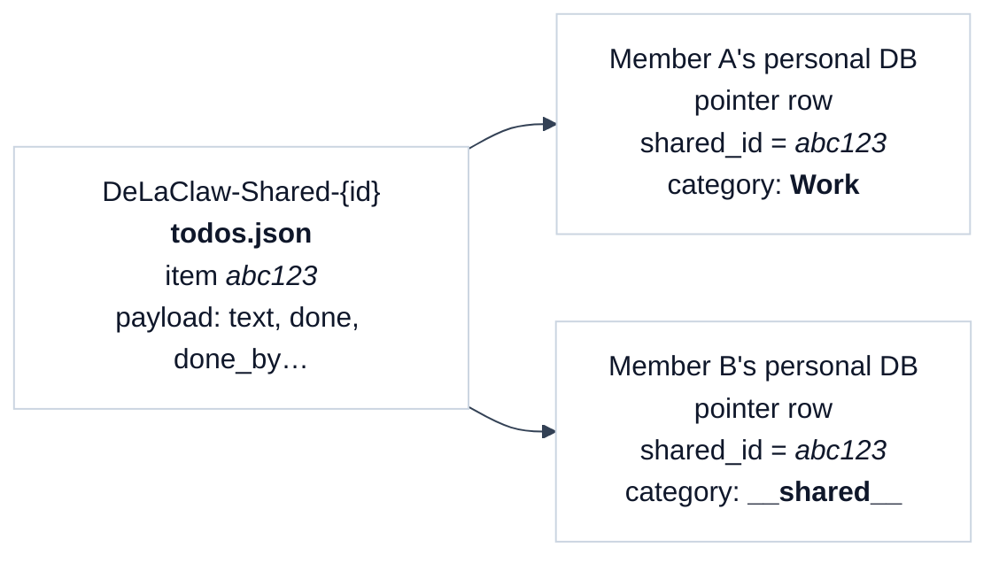
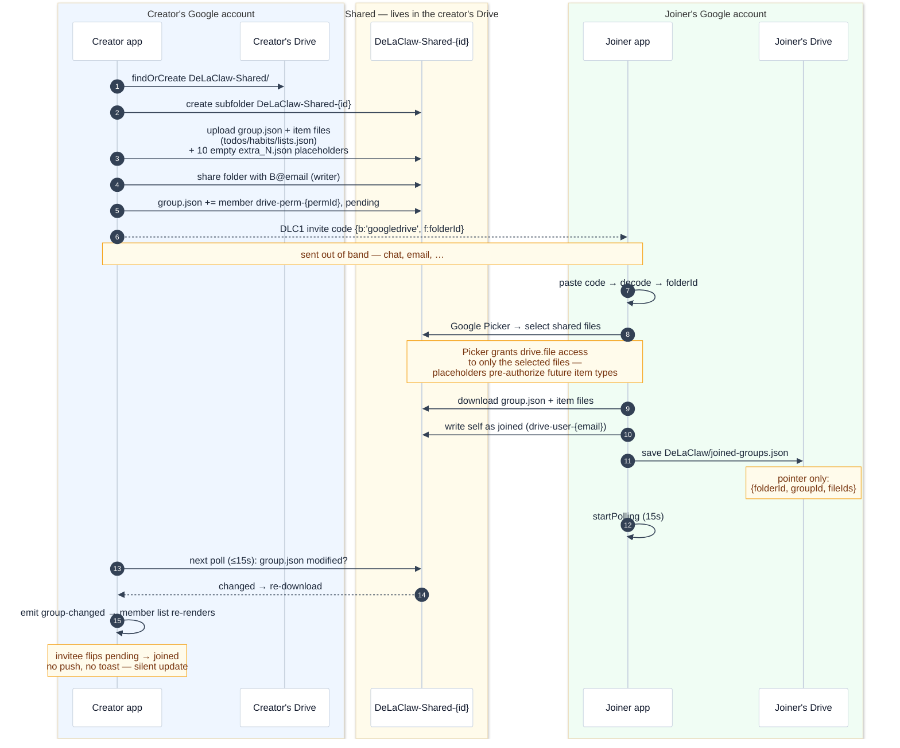
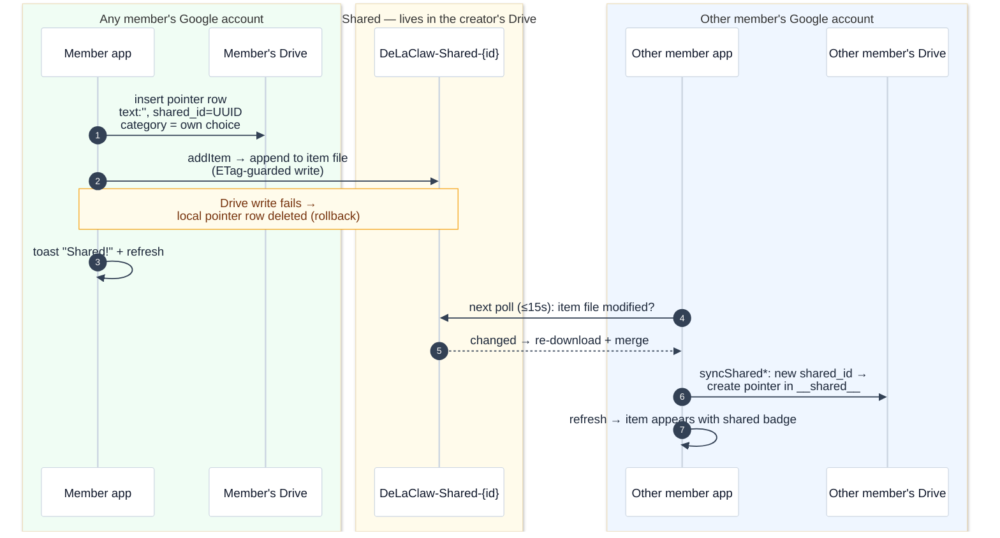
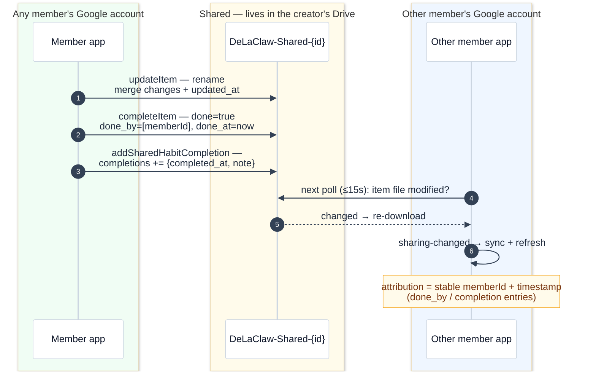
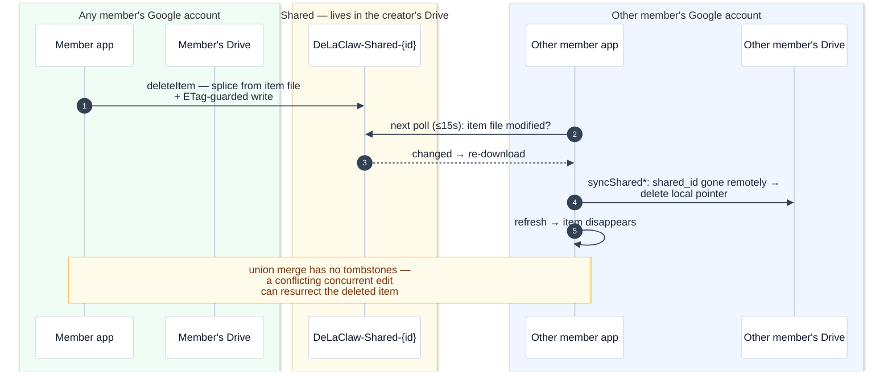
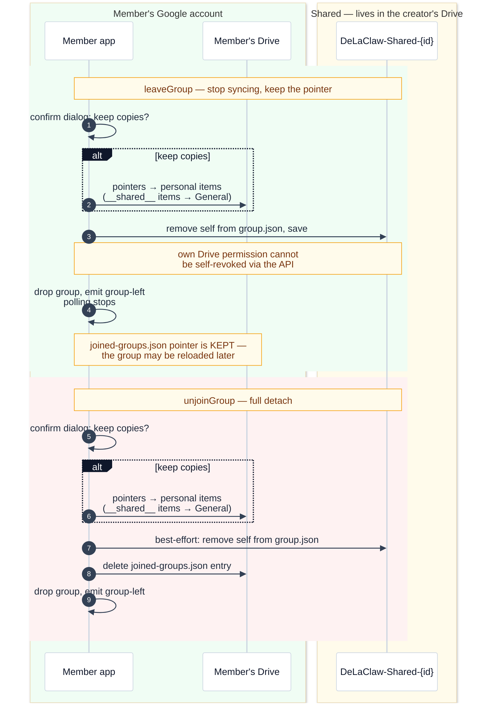
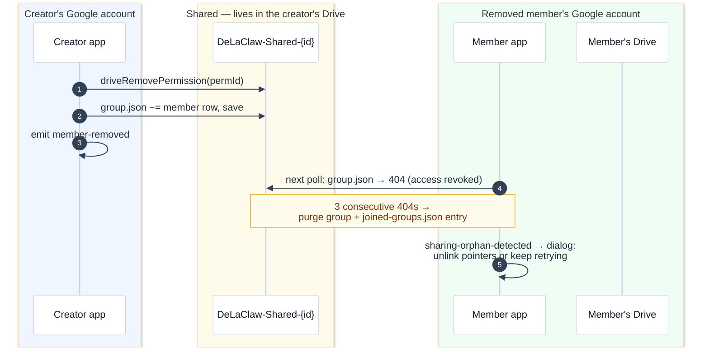
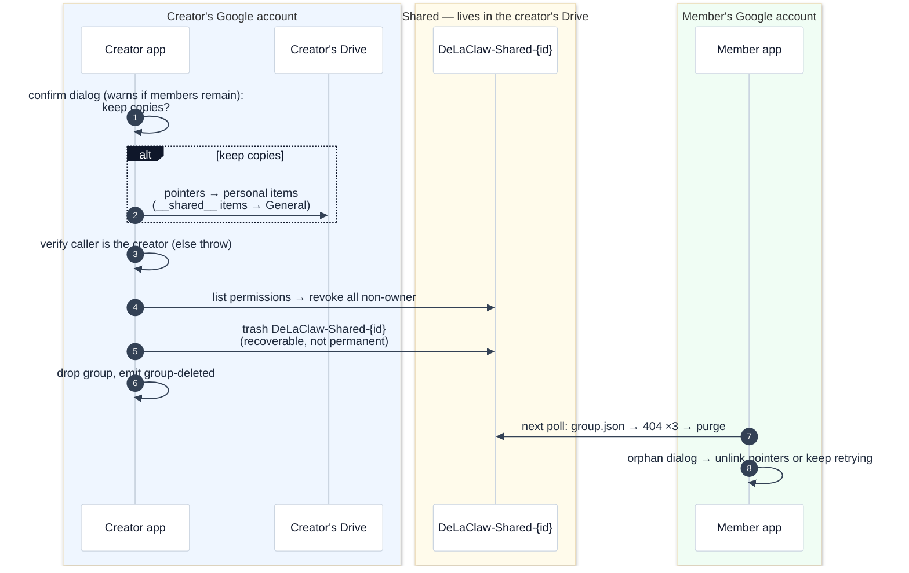

# Sharing

Last updated: 2026-09-07

DeLaClaw lets you share TODOs, habits, and list items with other people through sharing groups. This page explains the architecture, data flow, and security model.

## Overview

Sharing is **decentralized**: there is no central DeLaClaw server. One user (the **owner**) hosts the shared data on their own backend, and other users (**members**) connect to it via invite codes. The owner's project is the single source of truth for all group data.

```
┌──────────────────────────────────────────────────┐
│                  Sharing group                   │
│                                                  │
│  Owner (A)              Member (B)               │
│  ┌──────────┐           ┌──────────┐             │
│  │ Personal │           │ Personal │             │
│  │  tables  │           │  tables  │             │
│  │  (RLS)   │           │  (own DB)│             │
│  └────┬─────┘           └────┬─────┘             │
│       │                      │                   │
│       │  direct SQL          │  RPCs only        │
│       ▼                      ▼                   │
│  ┌─────────────────────────────────────────┐     │
│  │         Owner's Supabase project        │     │
│  │                                         │     │
│  │  sharing_groups   (group definitions)   │     │
│  │  sharing_members  (membership + tokens) │     │
│  │  sharing_items    (shared TODOs/habits)  │     │
│  └─────────────────────────────────────────┘     │
└──────────────────────────────────────────────────┘
```

## Concepts

**Group** — a named container that the owner creates. Each group has its own members, items, and invite codes.

**Invite code** — an opaque `DLC1.` prefixed string that encodes everything a joiner needs: the owner's project URL, anon key, group ID, a one-time token, and an optional expiry. The code is not encryption — security comes from server-side token hashing, expiry, and revocation.

**Local pointer** — when a shared item is displayed on a member's device, a minimal row exists in their local database (e.g. a `todos` row with `shared_id` + `shared_group_id` but empty `text`). The real content comes from the owner's `sharing_items` table at sync time.

**Shared category (`__shared__`)** — items received from others land in a protected `__shared__` category/list on the receiver's side. Items you share yourself stay in their current category.

## Backend-agnostic design

All sharing logic goes through an adapter interface (`sharing-interface.js`). Views (`todos.js`, `habits.js`, `lists.js`) never talk directly to Supabase or Drive — they call `state.sharing.addItem()`, `state.sharing.leaveGroup()`, etc.

```
┌──────────────────────────┐
│     Feature views        │
│  todos · habits · lists  │
└───────────┬──────────────┘
            │  state.sharing.*
            ▼
┌──────────────────────────┐
│   Sharing interface      │
│   (canonical contract)   │
└─────┬────────────┬───────┘
      │            │
      ▼            ▼
┌───────────┐ ┌────────────┐
│ Supabase  │ │   Drive    │
│  adapter  │ │  adapter   │
└───────────┘ └────────────┘
```

Every adapter is validated at init time against the interface contract — a missing method is a hard error, not a silent runtime crash.

## Supabase ↔ Supabase

> **Legacy.** The Supabase adapter is deprecated and its supporting migration/generator/UI code has been removed; this section is kept for migration reference only. Drive ↔ Drive below is the maintained path.

This was the primary and most complete sharing path. Both owner and members use Supabase backends.

### Data flow

```
Owner (A)                                    Member (B)
─────────                                    ──────────

1. Create group
   sharing_groups ← INSERT (direct)

2. Invite member
   sharing_members ← INSERT
   (token_hash, invited_label, joined_at=NULL)
   Generate DLC1 invite code ───────────────→ Receive invite code

3. Join                                      Decode DLC1 envelope
                                             verify_join_token(token) ──→ RPC validates hash
                                             confirm_join(token, name) ─→ RPC sets joined_at
                                             Store credentials encrypted
                                             in local joined_groups

4. Share item
   sharing_items ← INSERT (via RPC or direct)
   Local pointer created (shared_id, shared_group_id)

5. Sync                                      Poll every 30s
                                             get_shared_items(token, group_id) ──→ RPC
                                             Merge into local state
                                             Create/update local pointers

6. Edit shared item
   update_shared_item(token, id, payload) ──→ RPC (any member)

7. Complete shared habit/todo
   add_shared_item(token, ..., habit_completion) ──→ RPC
   Completion carries created_by (member_id)
```

### Two access paths

| | Owner (A) | Member (B) |
|---|---|---|
| **Auth** | Supabase magic-link session | Unauthenticated on A's project |
| **Read/write** | Direct SQL through RLS | SECURITY DEFINER RPCs only |
| **Token** | None needed | Hashed token verified on every RPC |
| **Tables visible** | All own tables | None directly — RPCs return filtered data |

### Security model

**RLS** — The owner's personal tables (`todos`, `habits`, etc.) use `owner or agent` policies: `owner_id = auth.uid() OR has_agent_access(owner_id)`. A member connecting with the anon key cannot read the owner's personal data.

**Token hashing** — Member tokens are stored as `SHA-256` hex digests in `sharing_members.token_hash`. The plaintext token exists only in the invite code and in the member's encrypted `joined_groups` row. Every RPC verifies: hash match + `joined_at IS NOT NULL` + `revoked_at IS NULL`.

**Credential encryption** — When a member joins, the invite credentials (URL, anon key, token) are encrypted client-side with AES-GCM (`crypto-sync.js`) using a per-user `sync_secret` stored in localStorage. The `joined_groups` table stores only ciphertext.

**Identity** — Emails are permission material, not identity. Shared identity is `memberId` (8-char UUID prefix) + group-local `displayName`. Raw emails never appear in shared group state.

### Creating a group

1. Owner opens **Settings → Sharing** and clicks **Create Group**
2. A `sharing_groups` row is inserted with the owner as `auth_owner_id`
3. A `sharing_members` row is created for the owner with `role='creator'`

### Inviting a member

1. Owner clicks **Invite** on the group → generates a one-time token
2. `sharing_members` row inserted: `token_hash` (SHA-256), `invited_label`, `joined_at=NULL`
3. An invite code (`DLC1.<base64url payload>`) is generated containing: URL, anon key, group ID, token, optional expiry
4. Owner copies the code or link and sends it privately

### Joining a group

1. Member pastes the invite code (or opens the invite link)
2. App decodes the `DLC1.` envelope and calls `verify_join_token(token)` → RPC returns group info
3. Member confirms → `confirm_join(token, display_name)` → RPC sets `joined_at = now()`
4. Credentials encrypted and stored in the member's local `joined_groups` table
5. Polling starts (every 30s) to fetch shared items from the owner's project

### Revoking a member

1. Owner clicks the revoke button on a member
2. `revoke_member(group_id, member_id)` RPC sets `revoked_at = now()` — soft revocation
3. All subsequent RPCs from the revoked member fail token validation (`revoked_at IS NULL` check)
4. Revoked members appear in a collapsible "removed" section in Settings

The revoked member's local pointers remain until they manually unjoin or the data is cleaned up on next sync failure.

### Leaving a group

1. Member clicks **Leave group**
2. `leave_group(token)` RPC deletes the member row (only non-creator members)
3. Client-side cleanup: local pointers (shared TODOs, habits, list items) are deleted from the member's database
4. `joined_groups` row removed locally

Items the leaving member created in the group stay — they are not deleted for other members.

### Deleting a group

1. Owner clicks **Delete group** — confirmation modal warns if there are active members
2. Owner's `sharing_groups` row is deleted → FK CASCADE deletes all `sharing_members` and `sharing_items`
3. Client-side cleanup: local pointers are cleared (`shared_id`, `shared_group_id` nullified on personal items)
4. Members discover the group is gone on their next poll and clean up locally

### Sharing an existing item

All share/unshare flows follow a **delete-and-recreate** pattern — no in-place ID mutation.

**Share:**
1. Create shared item on `sharing_items` (via RPC or direct)
2. Create a local pointer row with `shared_id` + `shared_group_id`
3. Delete the original personal item

For habits, all completion records are copied to the shared item before deleting the personal habit and its completions.

**Unshare (creator):**
1. Create a personal duplicate of the shared item
2. Delete the shared item from `sharing_items`

**Copy to personal (non-creator):**
1. Create a personal duplicate
2. Shared item stays for other members (not deleted)

### Sync and polling

| Path | Mechanism |
|---|---|
| Owner's groups | Supabase Realtime (Postgres changes subscription) |
| Joined groups | HTTP polling every 30s (`get_shared_items` RPC) |
| Tab focus | Immediate poll on visibility change |

Shared items are merged into local state at each sync — the owner's `sharing_items` table is the source of truth.

### Backup and restore

- **Creator-side tables** (`sharing_groups`, `sharing_members`, `sharing_items`) and **joiner-side** (`joined_groups`) are included in exports
- On import, `sharing_groups.auth_owner_id` is rewritten to the new `auth.uid()`
- If the Supabase project URL changed, a toast tells the owner to re-send invite links (members store the old URL)
- Members can reconnect without re-joining if they receive an invite for an existing `group_id` with a new URL — a reconnect modal updates stored credentials

## Drive ↔ Drive

Drive sharing has no server: the shared state is a folder in the **creator's** Google Drive, and every member reads and writes the same files through the Drive API. The joiner's own Drive only ever holds a pointer (`joined-groups.json`) with the shared folder's file IDs.

### Storage layout

```
Creator's Drive                                Joiner's Drive
───────────────                                ──────────────
My Drive/                                      My Drive/
├── DeLaClaw/                  (personal)      ├── DeLaClaw/                  (personal)
│   ├── todos.json                             │   ├── todos.json
│   ├── habits.json                            │   ├── habits.json
│   ├── lists.json                             │   ├── lists.json
│   └── joined-groups.json                     │   └── joined-groups.json  ◄── pointer only
│                                                  {folderId, groupId, fileIds}
└── DeLaClaw-Shared/           (shared root)
    └── DeLaClaw-Shared-{groupId}/
        ├── group.json         ← members, creator, name
        ├── todos.json         ← item files (one per type)
        ├── habits.json
        ├── lists.json
        └── extra_1..10.json   ← empty placeholders, pre-authorize
                                  future item types (avoids sending every
                                  member back through the Drive Picker)
```

- **Invite code**: `DLC1.<base64url({v:1, b:'googledrive', f:<folderId>})>` — one group-level code, no per-member tokens.
- **Access control**: Drive folder permission (writer) + the `group.json` member list. No RPC layer, no token hashing.
- **Sync**: every member polls every 15 s, keyed on each file's `modifiedTime`. Concurrent writes use ETags with up to two conflict retries; the merge is last-write-wins by union of item IDs.
- **Drive scopes**: with `drive.file` scope the joiner grants access through the Google Picker (only the selected files); with full `drive` scope the folder is listed directly.

### Local pointers and per-member buckets

Shared items do **not** force the same buckets on every member. Each member's personal database holds a **pointer row** per shared item (`shared_id` + `shared_group_id`, with empty `text`/`name`); the live content is overlaid from the group's item files at render time.

- Items **you** share stay in your current category with a shared badge.
- Items **received** from others land in the protected `__shared__` category — and like any other row, the pointer can then be moved into one of your own categories.
- Ordering (`sort_order`) is per-member and never synced.
- When a shared item disappears remotely, the next sync deletes the local pointer; when a whole group disappears, a confirmation dialog offers to unlink the pointers or keep retrying.



### Lifecycle

#### Invite → join



Join awareness is passive: the joiner's write to `group.json` bumps its `modifiedTime`; the creator's next poll (≤ 15 s) re-downloads it and the member list re-renders with the invitee flipped from pending to joined.

#### Create an item (creator and member)

The flow is identical for creator and member — shared items are collaboratively editable: any group member can add, update, or delete any item.



#### Modify an item (rename, mark done, habit completion)



#### Delete an item



#### Member leaves / unjoins



#### Creator removes a member



#### Creator deletes a group



#### Member deletes their DeLaClaw account connection (deleteAccount)

This is DeLaClaw's Drive-backed `deleteAccount` (trash the personal
`DeLaClaw/` folder, revoke OAuth), not deletion of the Google account itself —
that case is an open question (see the “Drive sharing” tab in the design
decisions space).

```mermaid
%%{init: {'theme': 'base', 'themeVariables': {'background': '#fbfaf8', 'actorBkg': '#ffffff', 'actorBorder': '#cbd5e1', 'actorTextColor': '#0f172a', 'actorLineColor': '#cbd5e1', 'signalColor': '#334155', 'signalTextColor': '#1e293b', 'noteBkgColor': '#fffbeb', 'noteBorderColor': '#f59e0b', 'noteTextColor': '#78350f', 'labelBoxBkgColor': '#0f172a', 'labelBoxBorderColor': '#0f172a', 'labelTextColor': '#ffffff'}}}%%
sequenceDiagram
    autonumber
    box rgb(240,253,244) Member's Google account
    participant MA as Member app
    participant MD as Member's Drive
    end
    box rgb(255,251,235) Shared — lives in the creator's Drive
    participant SF as DeLaClaw-Shared-{id}
    end

    MA->>MD: deleteAccount: trash personal<br/>DeLaClaw/ folder
    MA->>MA: revoke OAuth token
    Note over MD,SF: DeLaClaw-Shared/ lives at Drive root —<br/>it is NOT trashed; groups the member<br/>created survive with a ghost creator
    Note over SF: no leave/unjoin is performed —<br/>member rows stay in group.json (ghost members)
    Note over MA,SF: other members get no signal —<br/>the creator must removeUser manually
```

### Open design questions

Drawing these flows surfaced gaps and undecided behaviors. They are collected as a tab in the **DeLaClaw design decisions** space ("Drive sharing" tab): join notification, deletion tombstones, leave vs unjoin semantics, raw emails in member IDs, open-join admission, ghost creator IDs after removal, creator-only invite/remove enforcement, account-deletion cleanup, externally deleted accounts, placeholder exhaustion, receiver placement, and keep-vs-retry on remote deletion.

## Cross-backend sharing (future)

The adapter interface and invite code format (`DLC1.` envelope with `b` field) are designed to support cross-backend sharing — for example, a Supabase owner sharing with a Drive member. This is not implemented yet.

## Module structure

| Module | Role |
|---|---|
| `sharing-interface.js` | Canonical method contract; validated at init |
| `sharing-envelope.js` | Invite code encode/decode (`DLC1.<base64url>`) |
| `sharing-supabase.js` | Supabase adapter implementing the interface |
| `sharing-drive.js` | Drive adapter (stale) |
| `sharing-ui.js` | Settings pane, share popovers, badges, join flow |
| `sharing.js` | Factory that picks adapter by backend mode |
| `crypto-sync.js` | AES-GCM encryption for joined-group credentials |

## Related

- [ADR 0005 — Sharing behind adapter interface](adrs/0005-sharing-behind-adapter-interface.md)
- [Setup Guide — Supabase auth and sharing scopes](setup.md)
- [Privacy — Google Drive scopes and data exchange](privacy.md)
