# Sharing

Last updated: 2026-09-10

DeLaClaw lets you share TODOs, habits, and list items with other people through sharing groups. This page explains the architecture, data flow, and security model.

This page describes the **target design** — the 14 design decisions made on 2026-09-07 (recorded in the "DeLaClaw design decisions" space, "Drive sharing" tab). Assumption: sharing is not yet exposed, no groups exist in the wild, so there are no backward-compatibility constraints (greenfield). Implementation is pending.

## Overview

Sharing is **decentralized**: there is no central DeLaClaw server. One user (the **creator**) hosts the shared data in a folder on their own Google Drive, and other users (**members**) connect to it via invite codes. The creator's folder is the single source of truth for all group data.

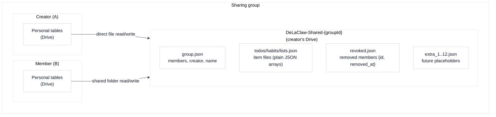

## Concepts

**Group** — a named container that the creator creates. Each group has its own members, items, and invite codes.

**Invite code** — an opaque `DLC1.` prefixed string that encodes everything a joiner needs: the backend type, the shared folder ID, the group ID, and an optional expiry. Access control comes from Google Drive folder permissions plus a local trusted-contacts allowlist.

**Local pointer** — when a shared item is displayed on a member's device, a minimal row exists in their local database (e.g. a `todos` row with `shared_id` + `shared_group_id` but empty `text`). The real content comes from the creator's item files at sync time.

**Shared category (`__shared__`)** — items received from others always land in a protected `__shared__` category/list on the receiver's side. Items you share yourself stay in their current category.

**Sync intents** — each group entry keeps, per item file, two in-memory sets: locally created IDs not yet acknowledged by a successful upload (`createdIds`) and locally deleted IDs not yet acknowledged (`deletedIds`). Reconciliation consults them: a local item missing remotely is retained only with a pending create intent (otherwise it was deleted remotely and is dropped); a remote item missing locally is suppressed only with a pending delete intent (otherwise it is a remote creation and is accepted). Items present on both sides resolve by newer `updated_at`. Each upload captures the exact intents its payload represents and clears only those on success — an ID created while an upload is in flight stays pending, and failed uploads retain their intents. The logic lives in the backend-agnostic `sharing-file-reconcile.js`, shared by all file-based adapters; nothing is written to Drive, so there is nothing to prune.

**revoked.json** — a notice file in the shared folder listing removed members as `{id, removed_at}` entries. A removed member keeps read-only access to this one file after losing access to everything else, so their client can distinguish "I was removed" from a flaky connection or a deleted group.

## Backend-agnostic design

All sharing logic goes through an adapter interface (`sharing-interface.js`). Views (`todos.js`, `habits.js`, `lists.js`) never talk directly to a backend — they call `state.sharing.addItem()`, `state.sharing.unjoinGroup()`, etc.

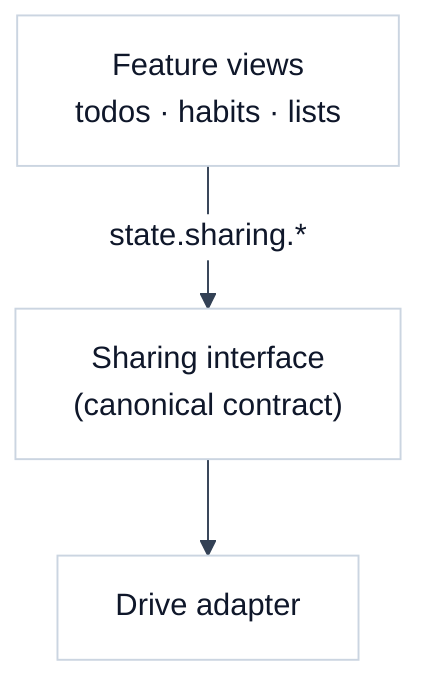

The adapter is validated at init time against the interface contract — a missing method is a hard error, not a silent runtime crash. The Supabase sharing adapter was removed with the Supabase backend; Drive is the only sharing path.

## Supabase ↔ Supabase (removed)

The Supabase sharing adapter (`sharing-supabase.js`) was removed together with the Supabase backend. The pre-deprecation codebase is preserved on the `dev-latest-supabase-support` branch.

## Drive ↔ Drive

The Google Drive sharing adapter is the only sharing path. Drive sharing has no server: the shared state is a folder in the **creator's** Google Drive, and every member reads and writes the same files through the Drive API. The joiner's own Drive only ever holds a pointer (`joined-groups.json`) with the shared folder's file IDs. Access control is enforced by Drive folder permissions plus a local trusted-contacts allowlist.

### Storage layout

```mermaid
%%{init: {'theme': 'base', 'themeVariables': {'background': '#fbfaf8', 'primaryColor': '#ffffff', 'primaryBorderColor': '#cbd5e1', 'primaryTextColor': '#0f172a', 'lineColor': '#334155'}}}%%
flowchart LR
    subgraph CD["Creator's Drive"]
        direction TB
        CDP["My Drive/DeLaClaw/ <i>(personal)</i><br/>todos.json · habits.json<br/>lists.json · joined-groups.json"]
        CDS["My Drive/DeLaClaw-Shared/ <i>(shared root)</i><br/>DeLaClaw-Shared-{groupId}/<br/>group.json · todos.json · habits.json<br/>lists.json · revoked.json<br/>extra_1..12.json"]
    end
    subgraph JD["Joiner's Drive"]
        direction TB
        JDP["My Drive/DeLaClaw/ <i>(personal)</i><br/>todos.json · habits.json · lists.json<br/>joined-groups.json &#9668; <b>pointer only</b><br/>{folderId, groupId, fileIds}"]
    end
```

- `group.json` — members (hashed IDs + pseudos), creator, name
- `todos.json` / `habits.json` / `lists.json` — item files: plain JSON arrays of item objects
- `revoked.json` — removed-member entries `{id, removed_at}`; read-only for removed members
- `extra_1..12.json` — empty placeholders, pre-authorize future item types (avoids sending every member back through the Drive Picker)

- **Invite code**: `DLC1.<base64url({v:1, b:'googledrive', f:<folderId>})>` — one group-level code, no per-member tokens.
- **Access control**: Drive folder permissions (writer) plus the trusted-contacts allowlist; `group.json` holds the member list. No RPC layer, no token hashing.
- **Member identity**: member IDs are opaque hashes (never raw emails); each member picks a pseudo, the hash stays immutable. The pending invite stores an `emailHash` so the joiner can match their invite without exposing the email.
- **Sync**: every member polls every 15 s, keyed on each file's `modifiedTime`. Concurrent writes use ETags with up to two conflict retries; the merge is intent-aware (`reconcileItems` in `sharing-file-reconcile.js`) — pending local creates are retained, pending local deletes suppress stale remote copies, and only deletions acknowledged by a successful upload propagate.
- **Drive scopes**: with `drive.file` scope the joiner grants access through the Google Picker (only the selected files, revoked.json included); with full `drive` scope the folder is listed directly.

### Local pointers and per-member buckets

Shared items do **not** force the same buckets on every member. Each member's personal database holds a **pointer row** per shared item (`shared_id` + `shared_group_id`, with empty `text`/`name`); the live content is overlaid from the group's item files at render time.

- Items **you** share stay in your current category with a shared badge.
- Items **received** from others always land in the protected `__shared__` category — and like any other row, the pointer can then be moved into one of your own categories.
- Ordering (`sort_order`) is per-member and never synced.
- When a shared item disappears remotely, the next sync deletes the local pointer; when a whole group disappears, a confirmation dialog offers to unlink the pointers or keep retrying (it re-prompts until resolved).

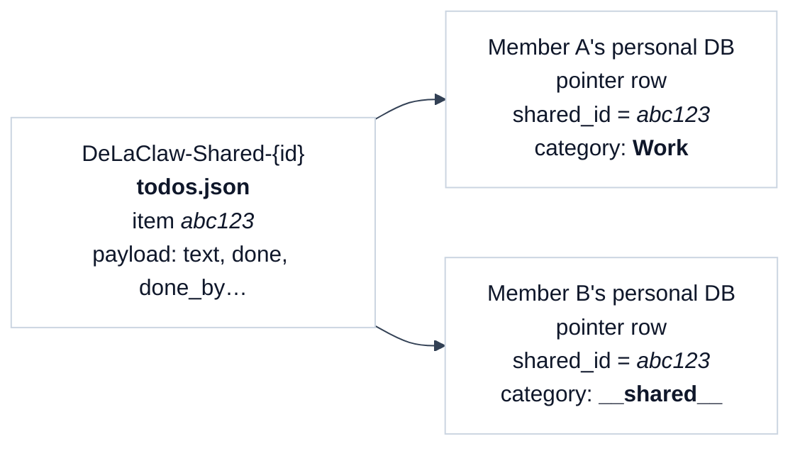

### Lifecycle

#### Invite → join

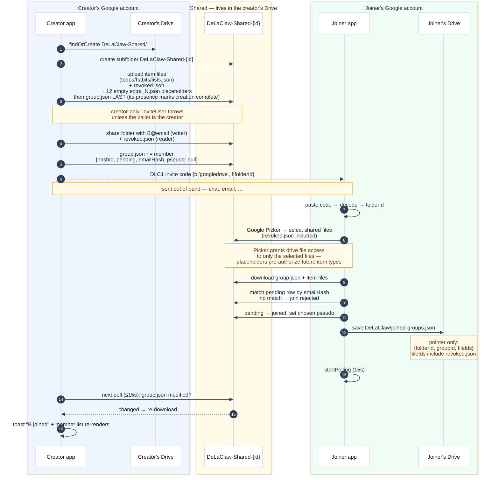

Joining requires two gates: Drive access to the folder (the join must download `group.json`) **and** a matching pending invite (by `emailHash`). Drive access alone is not enough.

#### Create an item (creator and member)

The flow is identical for creator and member — shared items are collaboratively editable: any group member can add, update, or delete any item.

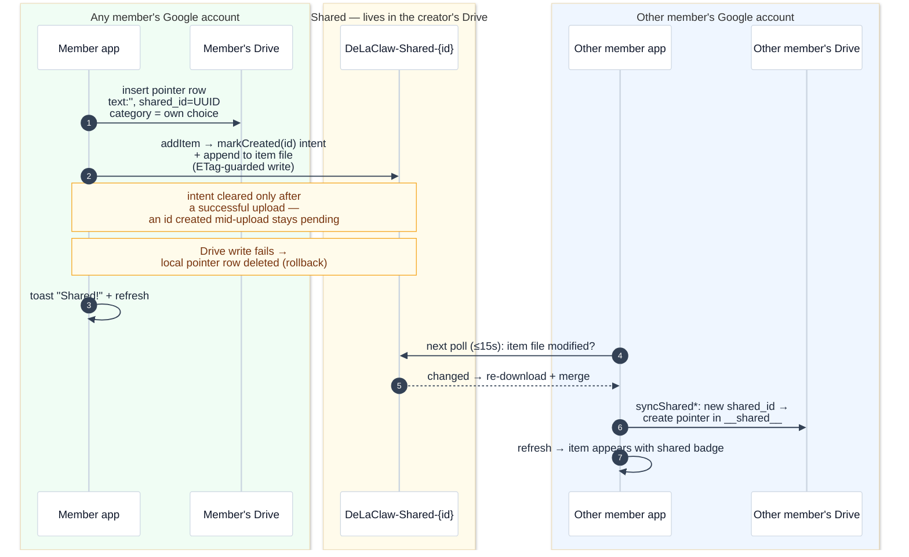

#### Modify an item (rename, mark done, habit completion)

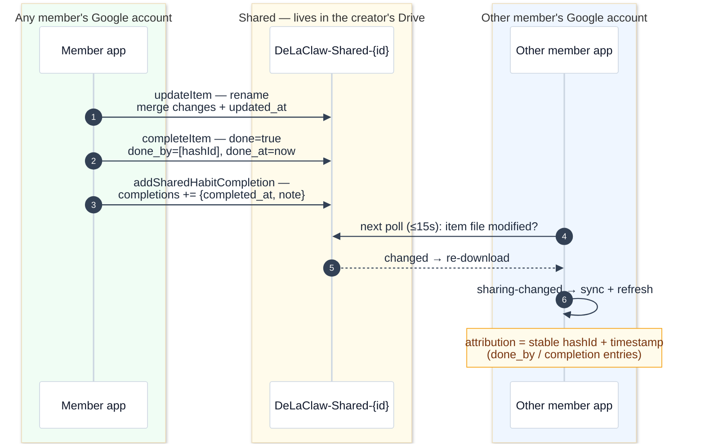

#### Delete an item

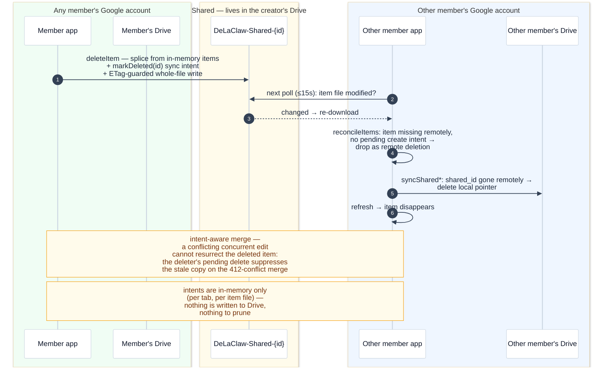

#### Member unjoins

`leaveGroup` is removed — `unjoinGroup` is the only leave path. Leaving flips the member row to `status: 'left'` (kept, not deleted) so the creator's next poll can revoke the Drive permission — only the folder owner can revoke it — before clearing the row. `status: 'left'` rows are never displayed, so the member list always reflects who actually has access. Caveat: if the creator never opens the app again, the Drive permission lingers until they do.

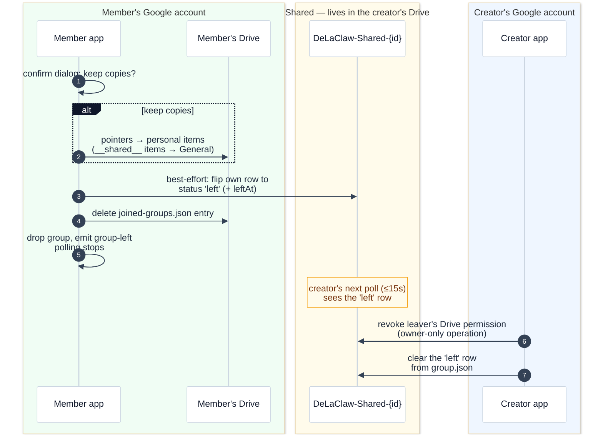

#### Creator removes a member

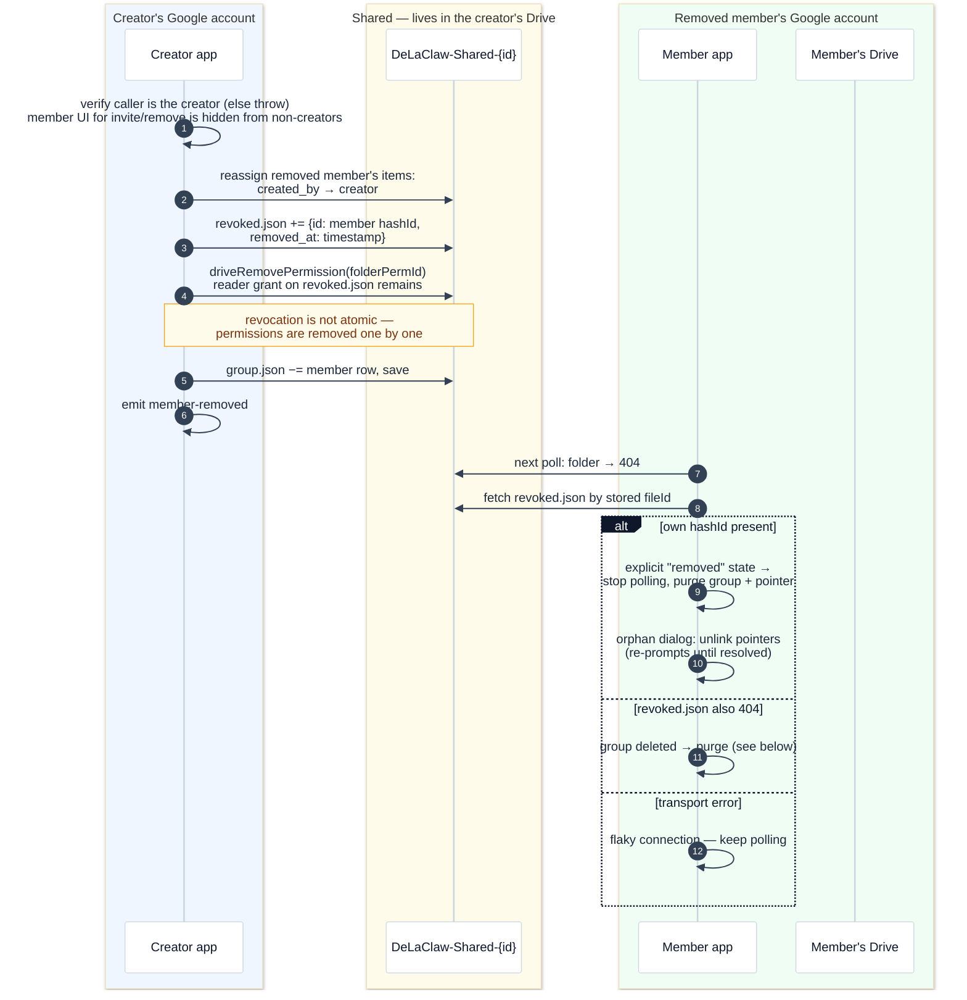

#### Creator deletes a group

Deletion goes through a ~30-day grace period so members get an explicit stop-polling signal instead of an abrupt 404.

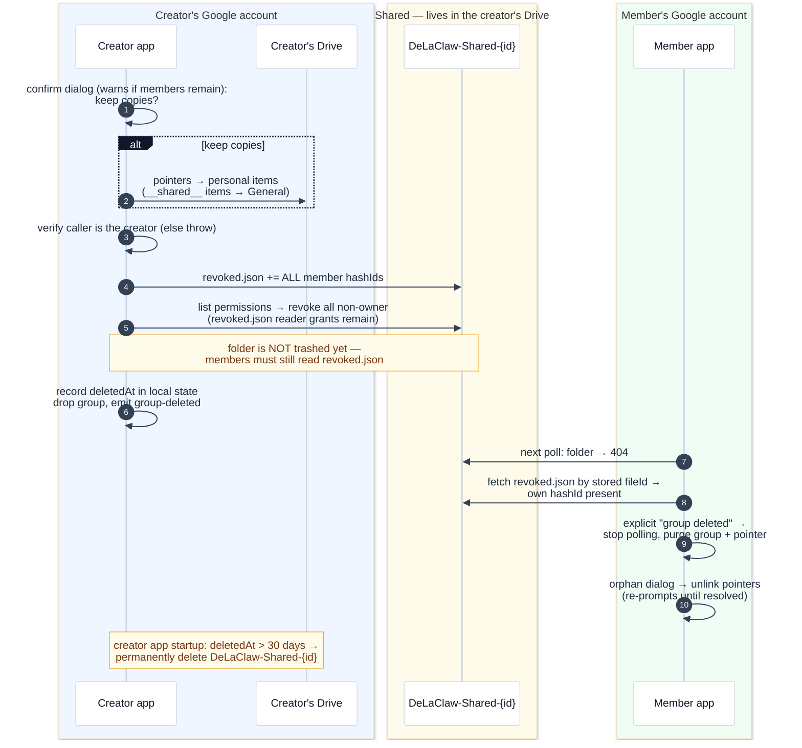

#### Member deletes their DeLaClaw account connection (deleteAccount)

This is DeLaClaw's Drive-backed `deleteAccount` (trash the personal
`DeLaClaw/` folder, revoke OAuth), not deletion of the Google account itself —
externally deleted Google accounts are handled manually (see below).

```mermaid
%%{init: {'theme': 'base', 'themeVariables': {'background': '#fbfaf8', 'actorBkg': '#ffffff', 'actorBorder': '#cbd5e1', 'actorTextColor': '#0f172a', 'actorLineColor': '#cbd5e1', 'signalColor': '#334155', 'signalTextColor': '#1e293b', 'noteBkgColor': '#fffbeb', 'noteBorderColor': '#f59e0b', 'noteTextColor': '#78350f', 'labelBoxBkgColor': '#0f172a', 'labelBoxBorderColor': '#0f172a', 'labelTextColor': '#ffffff'}}}%%
sequenceDiagram
    autonumber
    box rgb(240,253,244) Member's Google account
    participant MA as Member app
    participant MD as Member's Drive
    end
    box rgb(255,251,235) Shared — lives in the creator's Drive
    participant SF as DeLaClaw-Shared-{id}
    end

    MA->>SF: for each created group:<br/>grace-period deletion (see above)
    Note over MA,SF: created groups go through the<br/>revoked.json flow so members<br/>get the explicit stop-polling signal
    MA->>MD: trash personal DeLaClaw/ folder
    MA->>MA: revoke OAuth token (last)
    Note over MD,SF: joined groups are left alone —<br/>member rows linger as ghost rows<br/>(no unjoin performed)
    Note over MA,SF: the 30-day sweep needs the app to run —<br/>if never reopened, shell folders linger;<br/>members still infer deletion<br/>(revoked.json + folder both 404)
```

#### Externally deleted Google accounts (manual)

If a member deletes their Google account outside DeLaClaw, their Drive permission dies but their row stays in `group.json` — a ghost member. Detection is manual-only: the creator periodically re-validates Drive permissions against the `group.json` member list (a "check member accounts" action in Settings → Sharing) and removes the ghost rows surfaced by the check. No automatic polling or enforcement.

### Design decisions (decided 2026-09-07)

The flows above surfaced 14 design questions, all decided on 2026-09-07 and recorded in the **DeLaClaw design decisions** space ("Drive sharing" tab). Assumption: sharing is not yet exposed — no groups exist in the wild, so there are no backward-compatibility constraints (greenfield).

1. **Join notification** — the creator's poll shows a toast when a pending invitee flips to joined.
2. **Deletion sync intents** — each group entry keeps per-item-file in-memory `createdIds`/`deletedIds` intent sets; reconciliation retains pending creates, drops remotely-deleted items, and suppresses remotely-stale copies of pending deletes. Each upload acknowledges only the intents its payload represented, so an ID created mid-upload stays pending. The logic is backend-agnostic (`sharing-file-reconcile.js`), shared by all file-based adapters.
3. **leave vs unjoin** — `leaveGroup` removed; `unjoinGroup` is the only leave path. Leaving flips the member row to `status: 'left'`; the creator's poll revokes the leaver's Drive permission (owner-only) and clears the row, so leaving actually removes folder access. `left` rows are never displayed.
4. **Member IDs** — opaque hashes, never raw emails; members pick a pseudo, the hash stays immutable.
5. **Join admission** — joining requires a matching pending invite (by `emailHash`); Drive access alone is not enough.
6. **Removed members' items** — reassigned to the creator (`created_by` rewrite), no ghost creator IDs.
7. **Creator-only enforcement** — `inviteUser`/`removeUser` throw unless the caller is the creator; the invite/remove UI is hidden from non-creators.
8. **Account deletion** — joined groups are left alone; created groups are deleted via the grace-period flow.
9. **Externally deleted accounts** — manual detection only.
10. **Placeholder exhaustion** — `extra_N.json` raised from 10 to 12 now; behavior at exhaustion deferred.
11. **Received-item placement** — always `__shared__`.
12. **Orphan dialog** — re-prompts until the group returns or deletion is accepted.
13. **revoked.json on member removal** — removed members keep read-only access to a single `revoked.json` notice file.
14. **Group deletion grace period** — all member IDs written to `revoked.json`, shell folder kept ~30 days, then hard-deleted.


## Module structure

| Module | Role |
|---|---|
| `sharing-interface.js` | Canonical method contract; validated at init |
| `sharing-envelope.js` | Invite code encode/decode (`DLC1.<base64url>`) |
| `sharing-drive.js` | Drive adapter (implements the target design) |
| `sharing-ui.js` | Settings pane, share popovers, badges, join flow |
| `sharing.js` | Factory that picks adapter by backend mode |
| `crypto-sync.js` | AES-GCM encryption for joined-group credentials |

## Related

- [ADR 0005 — Sharing behind adapter interface](adrs/0005-sharing-behind-adapter-interface.md)
- [Setup Guide](setup.md)
- [Privacy — Google Drive scopes and data exchange](privacy.md)
