# Sharing

DeLaClaw lets you share TODOs, habits, and list items with other people through sharing groups. This page explains the architecture, data flow, and security model.

This page describes the sharing implementation — built from the 14 design decisions made on 2026-09-07 (recorded in the "DeLaClaw design decisions" space, "Drive sharing" tab). Assumption: sharing is not yet exposed, no groups exist in the wild, so there are no backward-compatibility constraints (greenfield).

## Overview

Sharing is **decentralized**: there is no central DeLaClaw server. One user (the **creator**) hosts the shared data in a folder on their own Google Drive, and other users (**members**) connect to it via invite codes. The creator's folder is the single source of truth for all group data.

Groups are managed from the **Group** tab: the sidebar lists your groups with an Add / Join Group button, and selecting a group shows its members, invite field, shared-item count, and delete/leave controls.

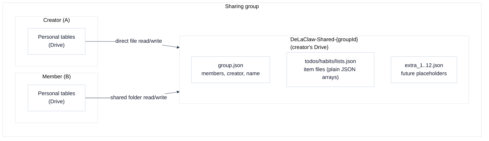
```mermaid
%%{init: {'theme': 'base', 'themeVariables': {'background': '#fbfaf8', 'primaryColor': '#ffffff', 'primaryBorderColor': '#cbd5e1', 'primaryTextColor': '#0f172a', 'lineColor': '#334155'}}}%%
flowchart TB
    subgraph GROUP["Sharing group"]
        subgraph CREATOR["Creator (A)"]
            PA["Personal tables<br/>(Drive)"]
        end
        subgraph MEMBER["Member (B)"]
            PB["Personal tables<br/>(Drive)"]
        end
        subgraph SHARED["DeLaClaw-Shared-{groupId}<br/>(creator's Drive)"]
            direction TB
            GJ["group.json<br/>members, creator, name"]
            ITEMS["todos/habits/lists.json<br/>item files (plain JSON arrays)"]
            EXTRA["extra_1..12.json<br/>future placeholders"]
        end
        PA -->|"direct file read/write"| SHARED
        PB -->|"shared folder read/write"| SHARED
    end
```

## Concepts

**Group** — a named container that the creator creates. Each group has its own members, items, and invite codes.

**Invite code** — an opaque `DLC1.` prefixed string that encodes everything a joiner needs: the backend type, the shared folder ID, the group ID, and an optional expiry. Access control comes from Google Drive folder permissions plus a local trusted-contacts allowlist.

**Local pointer** — when a shared item is displayed on a member's device, a minimal row exists in their local database (e.g. a `todos` row with `shared_id` + `shared_group_id` but empty `text`). The real content comes from the creator's item files at sync time.

**Shared category (`__shared__`)** — items received from others always land in a protected `__shared__` category/list on the receiver's side. Items you share yourself stay in their current category.

**Sync intents** — each group entry keeps, per item file, two in-memory sets: locally created IDs not yet acknowledged by a successful upload (`createdIds`) and locally deleted IDs not yet acknowledged (`deletedIds`). Reconciliation consults them: a local item missing remotely is retained only with a pending create intent (otherwise it was deleted remotely and is dropped); a remote item missing locally is suppressed only with a pending delete intent (otherwise it is a remote creation and is accepted). Items present on both sides resolve by newer `updated_at`. Each upload captures the exact intents its payload represents and clears only those on success — an ID created while an upload is in flight stays pending, and failed uploads retain their intents. The logic lives in the backend-agnostic `sharing-file-reconcile.js`, shared by all file-based adapters; nothing is written to Drive, so there is nothing to prune.

## Backend-agnostic design

All sharing logic goes through an adapter interface (`sharing-interface.js`). Views (`todos.js`, `habits.js`, `lists.js`) never talk directly to a backend — they call `state.sharing.addItem()`, `state.sharing.unjoinGroup()`, etc.

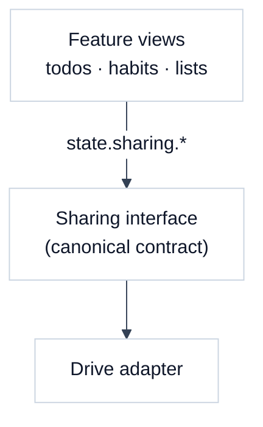
```mermaid
%%{init: {'theme': 'base', 'themeVariables': {'background': '#fbfaf8', 'primaryColor': '#ffffff', 'primaryBorderColor': '#cbd5e1', 'primaryTextColor': '#0f172a', 'lineColor': '#334155'}}}%%
flowchart TB
    VIEWS["Feature views<br/>todos · habits · lists"]
    SI["Sharing interface<br/>(canonical contract)"]
    DRIVE["Drive adapter"]
    VIEWS -->|"state.sharing.*"| SI
    SI --> DRIVE
```

The adapter is validated at init time against the interface contract — a missing method is a hard error, not a silent runtime crash. Drive is the only sharing path.

## Drive ↔ Drive

The Google Drive sharing adapter is the only sharing path. Drive sharing has no server: the shared state is a folder in the **creator's** Google Drive, and every member reads and writes the same files through the Drive API. The joiner's own Drive only ever holds pointers (the `groups` personal table) with the shared folders' file IDs, plus one name-only record per group the joiner created themselves. Access control is enforced by Drive folder permissions plus a local trusted-contacts allowlist.

### Storage layout

```mermaid
%%{init: {'theme': 'base', 'themeVariables': {'background': '#fbfaf8', 'primaryColor': '#ffffff', 'primaryBorderColor': '#cbd5e1', 'primaryTextColor': '#0f172a', 'lineColor': '#334155'}}}%%
flowchart LR
    subgraph CD["Creator's Drive"]
        direction TB
        CDP["My Drive/DeLaClaw/ <i>(personal)</i><br/>todos.json · habits.json<br/>lists.json · groups.json"]
        CDS["My Drive/DeLaClaw-Shared/ <i>(shared root)</i><br/>DeLaClaw-Shared-{groupId}/<br/>group.json · todos.json · habits.json<br/>lists.json · extra_1..12.json"]
    end
    subgraph JD["Joiner's Drive"]
        direction TB
        JDP["My Drive/DeLaClaw/ <i>(personal)</i><br/>todos.json · habits.json · lists.json<br/>groups.json &#9668; <b>pointers + own-group names</b><br/>{id, folderId, fileIds} · {id, name}"]
    end
```

_Folder names shown for production (`delaclaw.com`); dev and preview builds use `DeLaClawDev/`, `DeLaClawDev-Shared/`, etc. — see "Drive folder naming" in [Backends](backends.md)._

- `group.json` — members (hashed IDs + pseudos), creator, name
- `todos.json` / `habits.json` / `lists.json` — item files: plain JSON arrays of item objects
- `extra_1..12.json` — empty placeholders, pre-authorize future item types (avoids sending every member back through the Drive Picker)

- **Invite code**: `DLC1.<base64url({v:1, b:'googledrive', f:<folderId>})>` — one group-level code, no per-member tokens.
- **Access control**: Drive folder permissions (writer) plus the trusted-contacts allowlist; `group.json` holds the member list. No RPC layer, no token hashing.
- **Member identity**: the member ID is the SHA-256 hash of the member's *normalized* email (never the raw email) — stable per user across invites. Normalization lowercases, and for Gmail only (`gmail.com`/`googlemail.com`) strips dots and `+tags`, mirroring Google's semantics; other providers treat dots as significant, so they are left untouched.
- **Sync**: every member polls every 15 s, keyed on each file's `modifiedTime`. Concurrent writes use ETags with up to two conflict retries; the merge is intent-aware (`reconcileItems` in `sharing-file-reconcile.js`) — pending local creates are retained, pending local deletes suppress stale remote copies, and only deletions acknowledged by a successful upload propagate. The member roster poll is likewise intent-aware (`reconcileMembers`): rows this tab created but hasn't flushed yet are kept, everything else takes the remote version. Item-file downloads skip types with unflushed staged changes or an upload in flight — their own intents protect the staged work, and the next flush reconciles.
- **Drive scopes**: with `drive.file` scope the joiner grants access through the Google Picker (only the selected files); with full `drive` scope the folder is listed directly.

### Local pointers and per-member buckets

Shared items do **not** force the same buckets on every member. Each member's personal database holds a **pointer row** per shared item (`shared_id` + `shared_group_id`, with empty `text`/`name`); the live content is overlaid from the group's item files at render time.

- Items **you** share stay in your current category with a shared badge.
- Items **received** from others always land in the protected `__shared__` category — and like any other row, the pointer can then be moved into one of your own categories.
- Ordering (`sort_order`) is per-member and never synced.
- When a shared item disappears remotely, the next sync deletes the local pointer; when a whole group becomes unreachable (member removed, or the group deleted), the pointers are purged and a toast says access was lost — no dialog, no unlink choice.

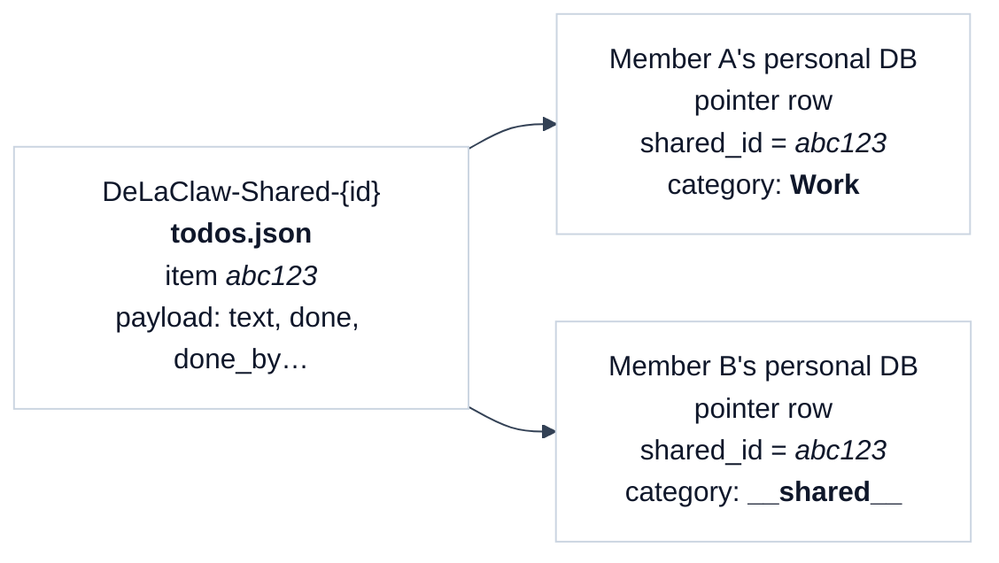
```mermaid
%%{init: {'theme': 'base', 'themeVariables': {'background': '#fbfaf8', 'primaryColor': '#ffffff', 'primaryBorderColor': '#cbd5e1', 'primaryTextColor': '#0f172a', 'lineColor': '#334155'}}}%%
flowchart LR
    SF["DeLaClaw-Shared-{id}<br/><b>todos.json</b><br/>item <i>abc123</i><br/>payload: text, done, done_by…"]
    PA["Member A's personal DB<br/>pointer row<br/>shared_id = <i>abc123</i><br/>category: <b>Work</b>"]
    PB["Member B's personal DB<br/>pointer row<br/>shared_id = <i>abc123</i><br/>category: <b>__shared__</b>"]
    SF --> PA
    SF --> PB
```

### Lifecycle

#### Invite → join

```mermaid
%%{init: {'theme': 'base', 'themeVariables': {'background': '#fbfaf8', 'actorBkg': '#ffffff', 'actorBorder': '#cbd5e1', 'actorTextColor': '#0f172a', 'actorLineColor': '#cbd5e1', 'signalColor': '#334155', 'signalTextColor': '#1e293b', 'noteBkgColor': '#fffbeb', 'noteBorderColor': '#f59e0b', 'noteTextColor': '#78350f', 'labelBoxBkgColor': '#0f172a', 'labelBoxBorderColor': '#0f172a', 'labelTextColor': '#ffffff'}}}%%
sequenceDiagram
    autonumber
    box rgb(239,246,255) Creator's Google account
    participant CP as Creator page<br/>(rendered UI)
    participant CA as Creator app<br/>(in-memory state + Drive API)
    participant CD as Creator's Drive
    end
    box rgb(255,251,235) Shared — lives in the creator's Drive
    participant SF as DeLaClaw-Shared-{id}
    end
    box rgb(240,253,244) Joiner's Google account
    participant JP as Joiner page<br/>(rendered UI)
    participant JA as Joiner app<br/>(in-memory state + Drive API)
    participant JD as Joiner's Drive
    end

    CP->>CA: Create group "{name}"
    CA->>CP: lock modal, show progress<br/>(folder → files → group.json)
    CA->>CD: findOrCreate DeLaClaw-Shared/
    CA->>SF: create subfolder DeLaClaw-Shared-{id}
    rect rgb(253, 237, 236)
    opt Step 3 or 4 fails
        CA->>CA: nothing created — nothing to trash
        CA->>CP: error toast, create modal unlocked
    end
    end
    CA->>SF: upload item files<br/>(todos/habits/lists.json)<br/>+ 12 empty extra_N.json placeholders<br/>then group.json LAST (its presence marks creation complete)
    rect rgb(253, 237, 236)
    opt Item-file or group.json upload fails
        SF-->>CA: Error
        CA->>CA: Partial folder trashed (best effort)<br/>no groups row written<br/>Tab killed mid-creation → orphan folder possible
        CA->>CP: error toast, create modal unlocked
    end
    end
    CA->>CD: upsert groups row<br/>(kind 'created', id + name only)<br/>own groups are discovered from these rows
    rect rgb(253, 237, 236)
    opt Groups-row upsert fails
        CA->>CA: throw — folder trashed (best effort)<br/>never registered in memory, never shown<br/>creation is all-or-nothing
        CA->>CP: error toast, create modal unlocked
    end
    end
    CA->>CP: toast "group created"<br/>sharing pane re-renders
    Note over CA,SF: creator-only: inviteUser throws<br/>unless the caller is the creator
    CP->>CA: invite B@email
    rect rgb(253, 237, 236)
    opt B already joined or has a pending invite
        CA->>CA: no Drive call, no group.json write
        CA->>CP: error toast
    end
    end
    CA->>SF: share folder with B@email (writer)
    rect rgb(253, 237, 236)
    opt Drive share fails
        SF-->>CA: Error — no invite issued<br/>no member row added to group.json
        CA->>CP: error toast
    end
    end
    CA->>SF: group.json += member<br/>{member_id: hash(email), status 'pending', display_name: null}
    rect rgb(253, 237, 236)
    opt group.json write fails
        CA->>CA: _groups: row rolled back,<br/>intent discarded — safe to retry<br/>Drive writer grant already issued — NOT revoked<br/>(reaped by the load-time audit)
        CA->>CP: error toast
    end
    end
    opt 412 conflict on upload (≤2 retries)
        CA->>CA: _groups: merge with downloaded copy —<br/>only rows this tab changed win locally.<br/>concurrent join (pending → joined) is kept<br/>pending↔joined with no intent: joined wins<br/>iff its invited_at ≥ the pending row's
    end
    CA->>CP: invite-code modal<br/>(DLC1 code + copy button)
    CA-->>JA: DLC1 invite code {b:'googledrive', f:folderId}
    Note over CA,JA: sent out of band — chat, email, …
    opt Non-desktop device (coarse pointer, no hover)
        JA->>JP: not-available notice<br/>no invite-code form offered
    end
    JP->>JA: open Join dialog, paste code
    JA->>JP: code modal (textarea + Join button)
    JA->>JA: decode → folderId
    rect rgb(253, 237, 236)
    opt Code undecodable
        JA->>JP: inline error in code modal<br/>modal stays open
    end
    opt Group already loaded
        JA->>JP: toast "already joined" (info) — no-op
    end
    end
    alt Direct path — joiner already has Drive folder access
        JA->>SF: list files directly (no Picker)
        JA->>JA: gate: all required files present<br/>(group, item types, extra_*)
        rect rgb(253, 237, 236)
        opt File set incomplete
            JA->>JA: silent fallback to Picker path<br/>nothing rendered
        end
        end
        JA->>SF: download group.json + item files
        rect rgb(253, 237, 236)
        opt group.json or any item file unreadable<br/>or no pending invite
            JA->>JP: inline error in code modal<br/>modal stays open
        end
        end
    else Picker path — explicit file grants
        JA->>JP: picker modal<br/>expects the full 16-file set
        JP->>JA: open Picker, select files
        JA->>SF: Google Picker → select shared files
        Note over JA,SF: Picker grants drive.file access<br/>to only the selected files —<br/>placeholders pre-authorize future item types
        rect rgb(253, 237, 236)
        opt Selection misses files (not the full 16-file set)
            JA->>JP: inline error in picker modal<br/>re-pick to retry
        end
        end
        JA->>JP: confirm modal<br/>(pseudo input, prefilled with Google account name)
        JP->>JA: confirm with chosen pseudo
        JA->>SF: download group.json + item files
        JA->>JA: match pending row by member_id
        rect rgb(253, 237, 236)
        opt group.json unreadable or no pending invite
            JA->>JP: inline error in confirm modal<br/>Drive access alone is not enough
        end
        end
    end
    Note over JA,SF: Run joinWithFileIds code, errors surface inline in the open modal
    JA->>JD: upsert groups row<br/>(groups.json, DeLaClawDev/ on dev builds)
    Note over JD: pointer only:<br/>{id, folderId, fileIds}
    rect rgb(253, 237, 236)
    opt Pointer upsert fails
        JA->>JP: inline error in code modal (direct)<br/>or confirm modal (picker)<br/>(group not joined — flip never ran)
    end
    end
    JA->>JA: _groups: entry stored in-memory<br/>(only after the pointer is persisted —<br/>a failed join never arms "already loaded")
    JA->>SF: pending → joined<br/>pseudo = picker confirm input, else Google account displayName<br/>(Drive about API, else email local part)<br/>(group.json re-uploaded)
    rect rgb(253, 237, 236)
    opt Re-upload fails
        JA->>JP: inline error in code modal (direct)<br/>or confirm modal (picker)<br/>pointer kept — the pending→joined flip self-heals at next startup
    end
    end
    JA->>JP: toast "joined"<br/>sharing pane re-renders
    JA->>JA: sharing-changed → syncSharedTodos/Habits<br/>pointers created for the group's items
    Note over JA: dated shared items → calendar events<br/>titled [TODO][category][group]
    JA->>JA: startPolling (15s)
    CA->>SF: next poll (≤15s): group.json modified?
    SF-->>CA: changed → re-download
    CA->>CA: diff members → newly joined
    CA->>CA: reconcile roster — rows this tab created<br/>but hasn't flushed yet are kept,<br/>everything else takes the remote version
    CA->>CP: toast ""{pseudo}" joined "{group}""<br/>member list re-renders
```

Joining requires two gates: Drive access to the folder (the join must download `group.json`) **and** a matching pending invite (by member ID, the hash of the joiner's email). Drive access alone is not enough.

Joining is desktop-only: the joiner must multi-select every group file in the Google file picker, which phones and tablets (coarse pointer, no hover) dismiss after a single tap. On such devices the join dialog says so instead of offering the invite-code form. The gate is capability-based (`isDesktopLike()`: fine pointer + hover), so touchscreen laptops are not gated.

If the group.json write fails at step 21, the Drive writer grant is left in place — it is reaped by the [load-time permission audit](sync-architecture.md?id=_3-%C2%B7-sharing-startup) on the next group load.

#### Create an item (creator and member)

The flow is identical for creator and member — shared items are collaboratively editable: any group member can add, update, or delete any item.

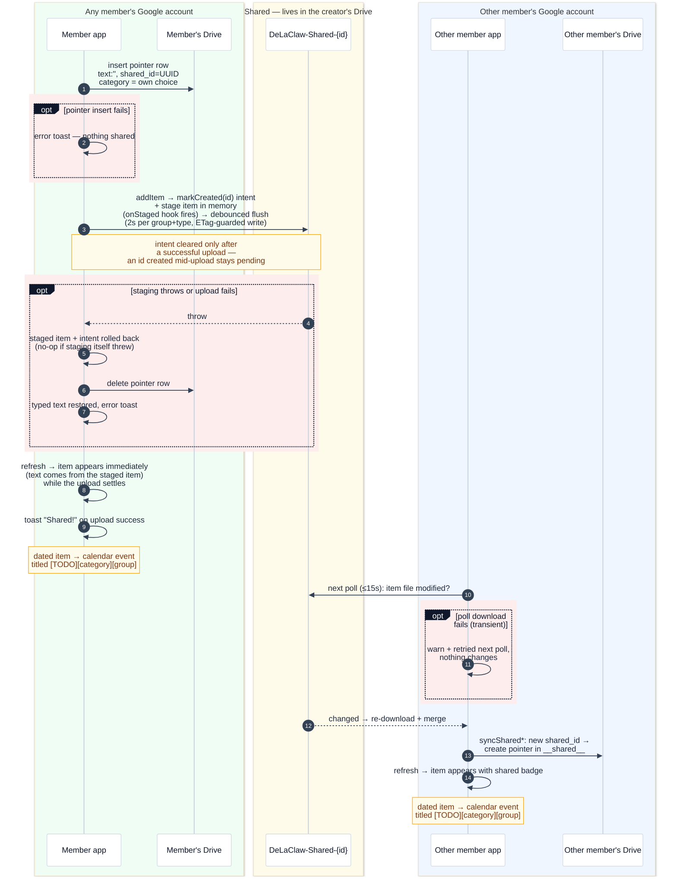
```mermaid
%%{init: {'theme': 'base', 'themeVariables': {'background': '#fbfaf8', 'actorBkg': '#ffffff', 'actorBorder': '#cbd5e1', 'actorTextColor': '#0f172a', 'actorLineColor': '#cbd5e1', 'signalColor': '#334155', 'signalTextColor': '#1e293b', 'noteBkgColor': '#fffbeb', 'noteBorderColor': '#f59e0b', 'noteTextColor': '#78350f', 'labelBoxBkgColor': '#0f172a', 'labelBoxBorderColor': '#0f172a', 'labelTextColor': '#ffffff'}}}%%
sequenceDiagram
    autonumber
    box rgb(240,253,244) Any member's Google account
    participant MA as Member app
    participant MD as Member's Drive
    end
    box rgb(255,251,235) Shared — lives in the creator's Drive
    participant SF as DeLaClaw-Shared-{id}
    end
    box rgb(239,246,255) Other member's Google account
    participant OA as Other member app
    participant OD as Other member's Drive
    end

    MA->>MD: insert pointer row<br/>text:'', shared_id=UUID<br/>category = own choice
    rect rgb(253, 237, 236)
    opt pointer insert fails
        MA->>MA: error toast — nothing shared
    end
    end
    MA->>SF: addItem → markCreated(id) intent<br/>+ stage item in memory<br/>(onStaged hook fires) → debounced flush<br/>(2s per group+type, ETag-guarded write)
    Note over MA,SF: intent cleared only after<br/>a successful upload —<br/>an id created mid-upload stays pending
    rect rgb(253, 237, 236)
    opt staging throws or upload fails
        SF-->>MA: throw
        MA->>MA: staged item + intent rolled back<br/>(no-op if staging itself threw)
        MA->>MD: delete pointer row
        MA->>MA: typed text restored, error toast
    end
    end
    MA->>MA: refresh → item appears immediately<br/>(text comes from the staged item)<br/>while the upload settles
    MA->>MA: toast "Shared!" on upload success
    Note over MA: dated item → calendar event<br/>titled [TODO][category][group]
    OA->>SF: next poll (≤15s): item file modified?
    rect rgb(253, 237, 236)
    opt poll download fails (transient)
        OA->>OA: warn + retried next poll,<br/>nothing changes
    end
    end
    SF-->>OA: changed → re-download + merge
    OA->>OD: syncShared*: new shared_id →<br/>create pointer in __shared__
    OA->>OA: refresh → item appears with shared badge
    Note over OA: dated item → calendar event<br/>titled [TODO][category][group]
```

The optimistic render above is the TODO add-row flow. Since v2.9.0 the same pattern applies to every shared mutation — share-existing, bulk share, rename, mark done, delete, unshare, habit edits and completions, list item edit/toggle: the view refreshes on in-memory staging via the `onStaged` hook, the debounced flush (2s per group+type) settles it in the background, and a failed upload rolls the local state back with an error toast.

#### Modify an item (rename, mark done, habit completion)

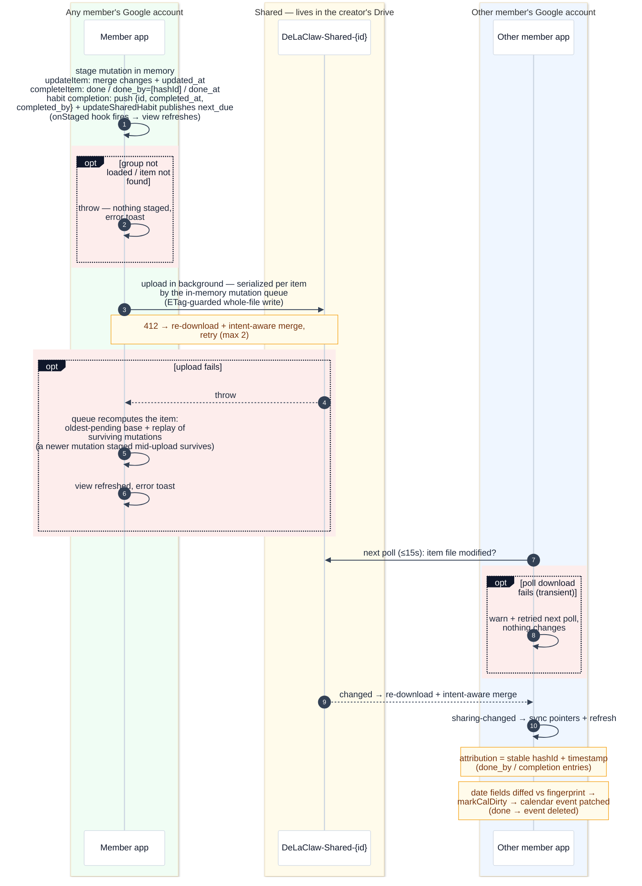
```mermaid
%%{init: {'theme': 'base', 'themeVariables': {'background': '#fbfaf8', 'actorBkg': '#ffffff', 'actorBorder': '#cbd5e1', 'actorTextColor': '#0f172a', 'actorLineColor': '#cbd5e1', 'signalColor': '#334155', 'signalTextColor': '#1e293b', 'noteBkgColor': '#fffbeb', 'noteBorderColor': '#f59e0b', 'noteTextColor': '#78350f', 'labelBoxBkgColor': '#0f172a', 'labelBoxBorderColor': '#0f172a', 'labelTextColor': '#ffffff'}}}%%
sequenceDiagram
    autonumber
    box rgb(240,253,244) Any member's Google account
    participant MA as Member app
    end
    box rgb(255,251,235) Shared — lives in the creator's Drive
    participant SF as DeLaClaw-Shared-{id}
    end
    box rgb(239,246,255) Other member's Google account
    participant OA as Other member app
    end

    MA->>MA: stage mutation in memory<br/>updateItem: merge changes + updated_at<br/>completeItem: done / done_by=[hashId] / done_at<br/>habit completion: push {id, completed_at,<br/>completed_by} + updateSharedHabit publishes next_due<br/>(onStaged hook fires → view refreshes)
    rect rgb(253, 237, 236)
    opt group not loaded / item not found
        MA->>MA: throw — nothing staged,<br/>error toast
    end
    end
    MA->>SF: upload in background — serialized per item<br/>by the in-memory mutation queue<br/>(ETag-guarded whole-file write)
    Note over MA,SF: 412 → re-download + intent-aware merge,<br/>retry (max 2)
    rect rgb(253, 237, 236)
    opt upload fails
        SF-->>MA: throw
        MA->>MA: queue recomputes the item:<br/>oldest-pending base + replay of<br/>surviving mutations<br/>(a newer mutation staged mid-upload survives)
        MA->>MA: view refreshed, error toast
    end
    end
    OA->>SF: next poll (≤15s): item file modified?
    rect rgb(253, 237, 236)
    opt poll download fails (transient)
        OA->>OA: warn + retried next poll,<br/>nothing changes
    end
    end
    SF-->>OA: changed → re-download + intent-aware merge
    OA->>OA: sharing-changed → sync pointers + refresh
    Note over OA: attribution = stable hashId + timestamp<br/>(done_by / completion entries)
    Note over OA: date fields diffed vs fingerprint →<br/>markCalDirty → calendar event patched<br/>(done → event deleted)
```

#### Delete an item

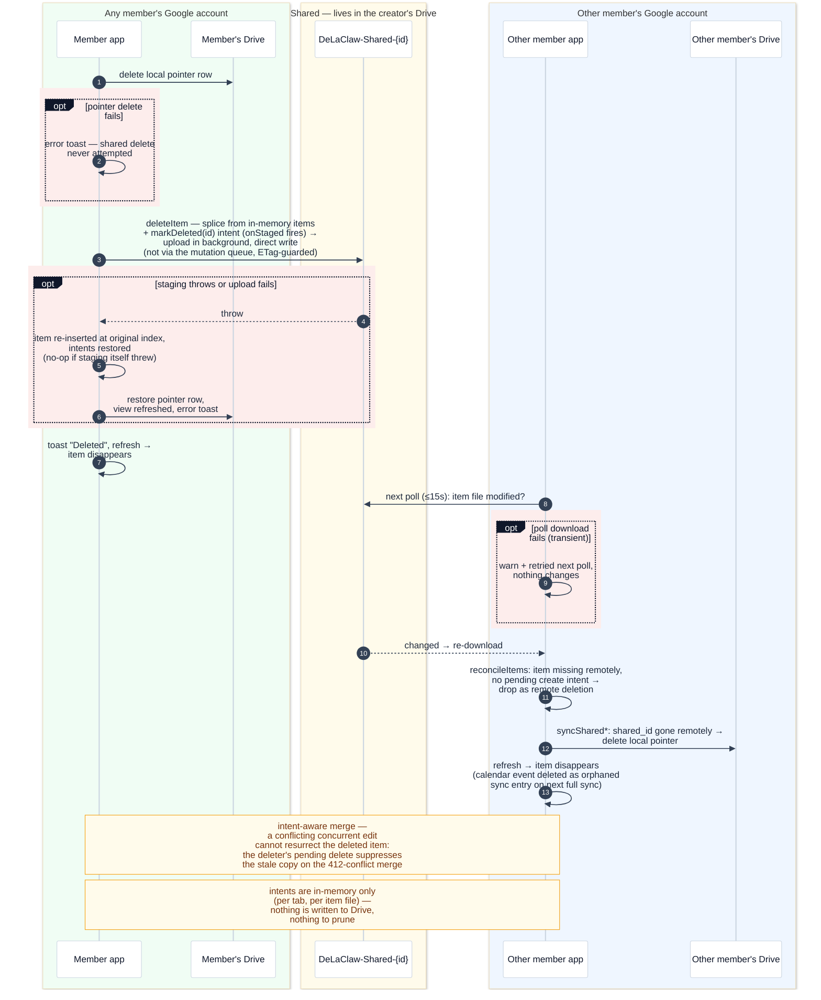
```mermaid
%%{init: {'theme': 'base', 'themeVariables': {'background': '#fbfaf8', 'actorBkg': '#ffffff', 'actorBorder': '#cbd5e1', 'actorTextColor': '#0f172a', 'actorLineColor': '#cbd5e1', 'signalColor': '#334155', 'signalTextColor': '#1e293b', 'noteBkgColor': '#fffbeb', 'noteBorderColor': '#f59e0b', 'noteTextColor': '#78350f', 'labelBoxBkgColor': '#0f172a', 'labelBoxBorderColor': '#0f172a', 'labelTextColor': '#ffffff'}}}%%
sequenceDiagram
    autonumber
    box rgb(240,253,244) Any member's Google account
    participant MA as Member app
    participant MD as Member's Drive
    end
    box rgb(255,251,235) Shared — lives in the creator's Drive
    participant SF as DeLaClaw-Shared-{id}
    end
    box rgb(239,246,255) Other member's Google account
    participant OA as Other member app
    participant OD as Other member's Drive
    end

    MA->>MD: delete local pointer row
    rect rgb(253, 237, 236)
    opt pointer delete fails
        MA->>MA: error toast — shared delete<br/>never attempted
    end
    end
    MA->>SF: deleteItem — splice from in-memory items<br/>+ markDeleted(id) intent (onStaged fires) →<br/>upload in background, direct write<br/>(not via the mutation queue, ETag-guarded)
    rect rgb(253, 237, 236)
    opt staging throws or upload fails
        SF-->>MA: throw
        MA->>MA: item re-inserted at original index,<br/>intents restored<br/>(no-op if staging itself threw)
        MA->>MD: restore pointer row,<br/>view refreshed, error toast
    end
    end
    MA->>MA: toast "Deleted", refresh →<br/>item disappears
    OA->>SF: next poll (≤15s): item file modified?
    rect rgb(253, 237, 236)
    opt poll download fails (transient)
        OA->>OA: warn + retried next poll,<br/>nothing changes
    end
    end
    SF-->>OA: changed → re-download
    OA->>OA: reconcileItems: item missing remotely,<br/>no pending create intent →<br/>drop as remote deletion
    OA->>OD: syncShared*: shared_id gone remotely →<br/>delete local pointer
    OA->>OA: refresh → item disappears<br/>(calendar event deleted as orphaned<br/>sync entry on next full sync)
    Note over MA,OA: intent-aware merge —<br/>a conflicting concurrent edit<br/>cannot resurrect the deleted item:<br/>the deleter's pending delete suppresses<br/>the stale copy on the 412-conflict merge
    Note over MA,OA: intents are in-memory only<br/>(per tab, per item file) —<br/>nothing is written to Drive,<br/>nothing to prune
```

#### Member unjoins

`leaveGroup` is removed — `unjoinGroup` is the only leave path. Leaving flips the member row to `status: 'left'` (kept, not deleted) so the creator's next poll can revoke the Drive permission — only the folder owner can revoke it — before clearing the row. `status: 'left'` rows are never displayed, so the member list always reflects who actually has access. Caveat: if the creator never opens the app again, the Drive permission lingers until they do. If the local groups-row delete never reaches Drive, the next load repairs it: a joined group whose own member row is already `'left'` in `group.json` is dropped without surfacing it, and the row delete is retried.

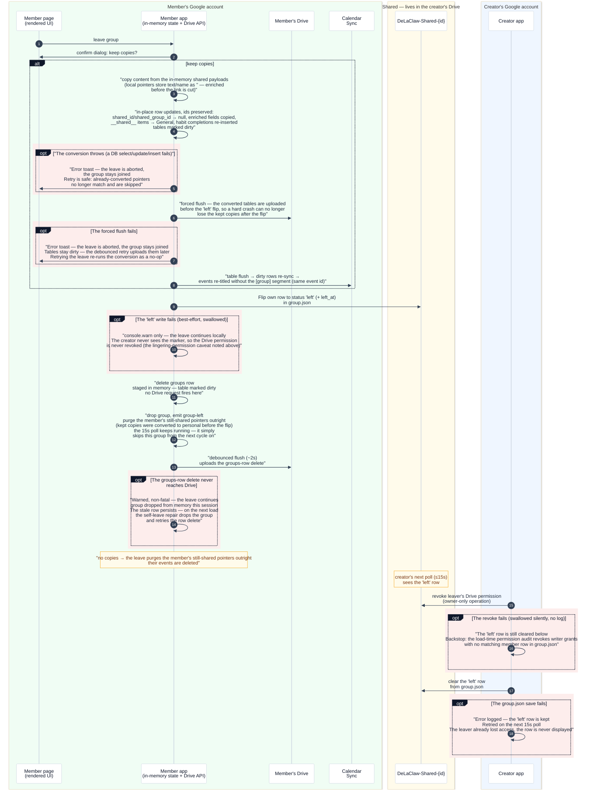
```mermaid
%%{init: {'theme': 'base', 'themeVariables': {'background': '#fbfaf8', 'actorBkg': '#ffffff', 'actorBorder': '#cbd5e1', 'actorTextColor': '#0f172a', 'actorLineColor': '#cbd5e1', 'signalColor': '#334155', 'signalTextColor': '#1e293b', 'noteBkgColor': '#fffbeb', 'noteBorderColor': '#f59e0b', 'noteTextColor': '#78350f', 'labelBoxBkgColor': '#0f172a', 'labelBoxBorderColor': '#0f172a', 'labelTextColor': '#ffffff'}}}%%
sequenceDiagram
    autonumber
    box rgb(240,253,244) Member's Google account
    participant MP as Member page<br/>(rendered UI)
    participant MA as Member app<br/>(in-memory state + Drive API)
    participant MD as Member's Drive
    participant CAL as Calendar<br/>Sync
    end
    box rgb(255,251,235) Shared — lives in the creator's Drive
    participant SF as DeLaClaw-Shared-{id}
    end
    box rgb(239,246,255) Creator's Google account
    participant CA as Creator app
    end

    MP->>MA: leave group
    MA->>MP: confirm dialog: keep copies?
    alt keep copies
    MA->>MA: "copy content from the in-memory shared payloads<br/>(local pointers store text/name as '' — enriched<br/>before the link is cut)"
    MA->>MA: "in-place row updates, ids preserved:<br/>shared_id/shared_group_id → null, enriched fields copied,<br/>__shared__ items → General, habit completions re-inserted<br/>tables marked dirty"
    rect rgb(253, 237, 236)
    opt "The conversion throws (a DB select/update/insert fails)"
        MA->>MP: "Error toast — the leave is aborted,<br/>the group stays joined<br/>Retry is safe: already-converted pointers<br/>no longer match and are skipped"
    end
    end
    MA->>MD: "forced flush — the converted tables are uploaded<br/>before the 'left' flip, so a hard crash can no longer<br/>lose the kept copies after the flip"
    rect rgb(253, 237, 236)
    opt The forced flush fails
        MA->>MP: "Error toast — the leave is aborted, the group stays joined<br/>Tables stay dirty — the debounced retry uploads them later<br/>Retrying the leave re-runs the conversion as a no-op"
    end
    end
    MA->>CAL: "table flush → dirty rows re-sync →<br/>events re-titled without the [group] segment (same event id)"
    end
    MA->>SF: Flip own row to status 'left' (+ left_at)<br/>in group.json
    rect rgb(253, 237, 236)
    opt The 'left' write fails (best-effort, swallowed)
        MA->>MA: "console.warn only — the leave continues locally<br/>The creator never sees the marker, so the Drive permission<br/>is never revoked (the lingering-permission caveat noted above)"
    end
    end
    MA->>MA: "delete groups row<br/>staged in memory — table marked dirty<br/>no Drive request fires here"
    MA->>MA: "drop group, emit group-left<br/>purge the member's still-shared pointers outright<br/>(kept copies were converted to personal before the flip)<br/>the 15s poll keeps running — it simply<br/>skips this group from the next cycle on"
    MA->>MD: "debounced flush (~2s)<br/>uploads the groups-row delete"
    rect rgb(253, 237, 236)
    opt The groups-row delete never reaches Drive
        MA->>MA: "Warned, non-fatal — the leave continues<br/>group dropped from memory this session<br/>The stale row persists — on the next load<br/>the self-leave repair drops the group<br/>and retries the row delete"
    end
    end
    Note over MA: "no copies → the leave purges the member's still-shared pointers outright<br/>their events are deleted"
    Note over SF: creator's next poll (≤15s)<br/>sees the 'left' row
    CA->>SF: revoke leaver's Drive permission<br/>(owner-only operation)
    rect rgb(253, 237, 236)
    opt The revoke fails (swallowed silently, no log)
        CA->>CA: "The 'left' row is still cleared below<br/>Backstop: the load-time permission audit revokes writer grants<br/>with no matching member row in group.json"
    end
    end
    CA->>SF: clear the 'left' row<br/>from group.json
    rect rgb(253, 237, 236)
    opt The group.json save fails
        CA->>CA: "Error logged — the 'left' row is kept<br/>Retried on the next 15s poll<br/>The leaver already lost access, the row is never displayed"
    end
    end
```

#### Creator removes a member

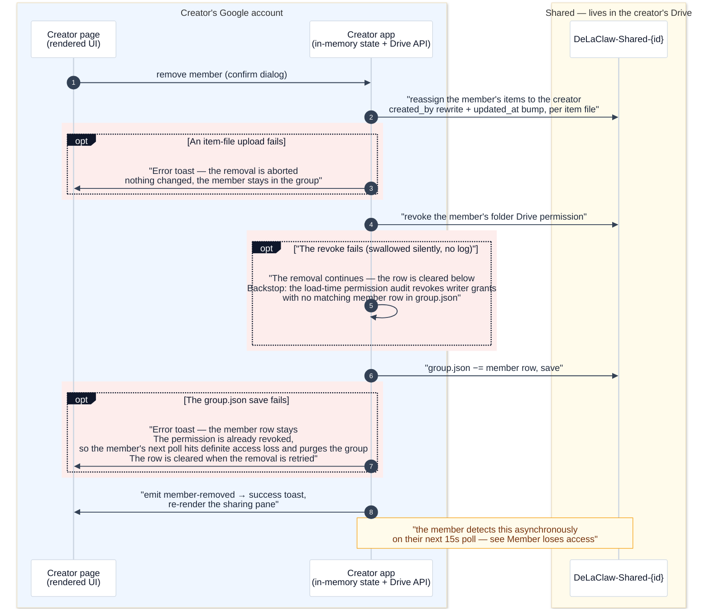
```mermaid
%%{init: {'theme': 'base', 'themeVariables': {'background': '#fbfaf8', 'actorBkg': '#ffffff', 'actorBorder': '#cbd5e1', 'actorTextColor': '#0f172a', 'actorLineColor': '#cbd5e1', 'signalColor': '#334155', 'signalTextColor': '#1e293b', 'noteBkgColor': '#fffbeb', 'noteBorderColor': '#f59e0b', 'noteTextColor': '#78350f', 'labelBoxBkgColor': '#0f172a', 'labelBoxBorderColor': '#0f172a', 'labelTextColor': '#ffffff'}}}%%
sequenceDiagram
    autonumber
    box rgb(239,246,255) Creator's Google account
    participant CP as Creator page<br/>(rendered UI)
    participant CA as Creator app<br/>(in-memory state + Drive API)
    end
    box rgb(255,251,235) Shared — lives in the creator's Drive
    participant SF as DeLaClaw-Shared-{id}
    end

    CP->>CA: remove member (confirm dialog)
    CA->>SF: "reassign the member's items to the creator<br/>created_by rewrite + updated_at bump, per item file"
    rect rgb(253, 237, 236)
    opt An item-file upload fails
        CA->>CP: "Error toast — the removal is aborted<br/>nothing changed, the member stays in the group"
    end
    end
    CA->>SF: "revoke the member's folder Drive permission"
    rect rgb(253, 237, 236)
    opt "The revoke fails (swallowed silently, no log)"
        CA->>CA: "The removal continues — the row is cleared below<br/>Backstop: the load-time permission audit revokes writer grants<br/>with no matching member row in group.json"
    end
    end
    CA->>SF: "group.json −= member row, save"
    rect rgb(253, 237, 236)
    opt The group.json save fails
        CA->>CP: "Error toast — the member row stays<br/>The permission is already revoked,<br/>so the member's next poll hits definite access loss and purges the group<br/>The row is cleared when the removal is retried"
    end
    end
    CA->>CP: "emit member-removed → success toast,<br/>re-render the sharing pane"
    Note over CA,SF: "the member detects this asynchronously<br/>on their next 15s poll — see Member loses access"
```

#### Member loses access (removed or group deleted)

Removal and deletion are treated the same from the member's side: the group
folder becomes unreachable either way, and Drive cannot tell "you were
removed" from "the group was deleted" (both surface as 404). So a definite
access loss purges the group — pointers deleted outright, no dialog — and a
toast says access was lost. What distinguishes access loss from a flaky
connection is the error's `reason` field: a 404, or a 403 carrying a known
access-loss reason (`insufficientPermissions`, `forbidden`), proves the folder
is gone for good. Anything else — a throttled 403, a 403 with an unknown or
missing reason, a 5xx, a network blip — is transient and retried on the next
poll; it never purges.

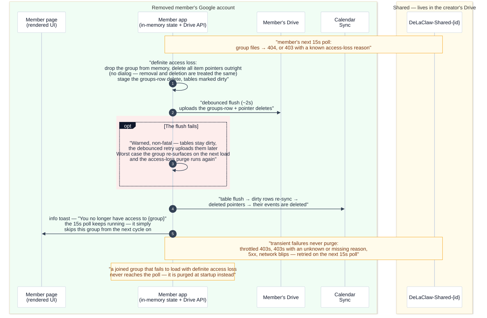
```mermaid
%%{init: {'theme': 'base', 'themeVariables': {'background': '#fbfaf8', 'actorBkg': '#ffffff', 'actorBorder': '#cbd5e1', 'actorTextColor': '#0f172a', 'actorLineColor': '#cbd5e1', 'signalColor': '#334155', 'signalTextColor': '#1e293b', 'noteBkgColor': '#fffbeb', 'noteBorderColor': '#f59e0b', 'noteTextColor': '#78350f', 'labelBoxBkgColor': '#0f172a', 'labelBoxBorderColor': '#0f172a', 'labelTextColor': '#ffffff'}}}%%
sequenceDiagram
    autonumber
    box rgb(240,253,244) Removed member's Google account
    participant MP as Member page<br/>(rendered UI)
    participant MA as Member app<br/>(in-memory state + Drive API)
    participant MD as Member's Drive
    participant CAL as Calendar<br/>Sync
    end
    box rgb(255,251,235) Shared — lives in the creator's Drive
    participant SF as DeLaClaw-Shared-{id}
    end

    Note over MA,SF: "member's next 15s poll:<br/>group files → 404, or 403 with a known access-loss reason"
    MA->>MA: "definite access loss:<br/>drop the group from memory, delete all item pointers outright<br/>(no dialog — removal and deletion are treated the same)<br/>stage the groups-row delete, tables marked dirty"
    MA->>MD: "debounced flush (~2s)<br/>uploads the groups-row + pointer deletes"
    rect rgb(253, 237, 236)
    opt The flush fails
        MA->>MA: "Warned, non-fatal — tables stay dirty,<br/>the debounced retry uploads them later<br/>Worst case the group re-surfaces on the next load<br/>and the access-loss purge runs again"
    end
    end
    MA->>CAL: "table flush → dirty rows re-sync →<br/>deleted pointers → their events are deleted"
    MA->>MP: info toast — "You no longer have access to {group}"<br/>the 15s poll keeps running — it simply<br/>skips this group from the next cycle on
    Note over MA,SF: "transient failures never purge:<br/>throttled 403s, 403s with an unknown or missing reason,<br/>5xx, network blips — retried on the next 15s poll"
    Note over MA: "a joined group that fails to load with definite access loss<br/>never reaches the poll — it is purged at startup instead"
```

#### Creator deletes a group

Deletion revokes every member's folder permission and trashes the subfolder immediately (recoverable from Drive trash). No deletion marker is written — members take the access-loss path of "Member loses access" below. Calendar events follow through the debounced table flush: kept items' events are re-titled (personal, no `[Group]`), deleted pointers' events are removed.

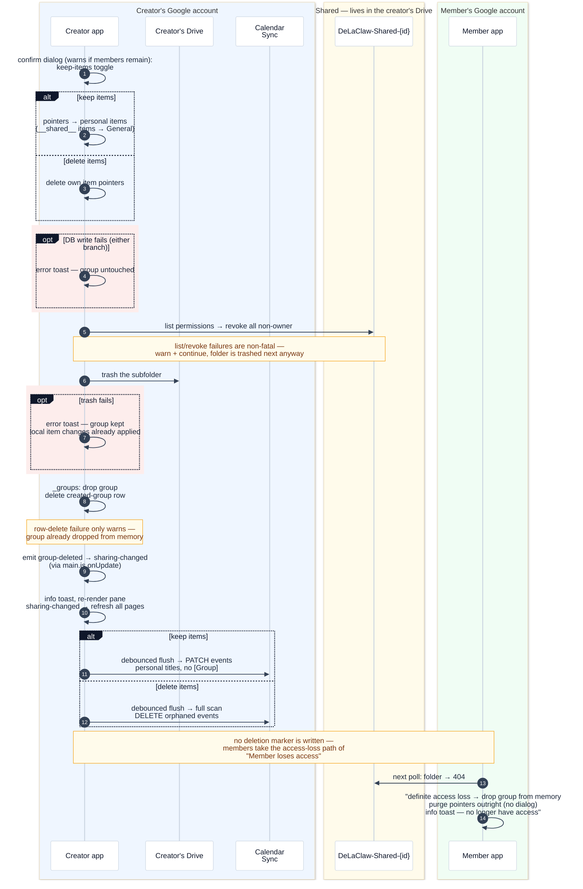
```mermaid
%%{init: {'theme': 'base', 'themeVariables': {'background': '#fbfaf8', 'actorBkg': '#ffffff', 'actorBorder': '#cbd5e1', 'actorTextColor': '#0f172a', 'actorLineColor': '#cbd5e1', 'signalColor': '#334155', 'signalTextColor': '#1e293b', 'noteBkgColor': '#fffbeb', 'noteBorderColor': '#f59e0b', 'noteTextColor': '#78350f', 'labelBoxBkgColor': '#0f172a', 'labelBoxBorderColor': '#0f172a', 'labelTextColor': '#ffffff'}}}%%
sequenceDiagram
    autonumber
    box rgb(239,246,255) Creator's Google account
    participant CA as Creator app
    participant CD as Creator's Drive
    participant CAL as Calendar<br/>Sync
    end
    box rgb(255,251,235) Shared — lives in the creator's Drive
    participant SF as DeLaClaw-Shared-{id}
    end
    box rgb(240,253,244) Member's Google account
    participant MA as Member app
    end

    CA->>CA: confirm dialog (warns if members remain):<br/>keep-items toggle
    alt keep items
    CA->>CA: pointers → personal items<br/>(__shared__ items → General)
    else delete items
    CA->>CA: delete own item pointers
    end
    rect rgb(253, 237, 236)
    opt DB write fails (either branch)
        CA->>CA: error toast — group untouched
    end
    end
    CA->>SF: list permissions → revoke all non-owner
    Note over CA,SF: list/revoke failures are non-fatal —<br/>warn + continue, folder is trashed next anyway
    CA->>CD: trash the subfolder
    rect rgb(253, 237, 236)
    opt trash fails
        CA->>CA: error toast — group kept<br/>local item changes already applied
    end
    end
    CA->>CA: _groups: drop group<br/>delete created-group row
    Note over CA: row-delete failure only warns —<br/>group already dropped from memory
    CA->>CA: emit group-deleted → sharing-changed<br/>(via main.js onUpdate)
    CA->>CA: info toast, re-render pane<br/>sharing-changed → refresh all pages
    alt keep items
    CA->>CAL: debounced flush → PATCH events<br/>personal titles, no [Group]
    else delete items
    CA->>CAL: debounced flush → full scan<br/>DELETE orphaned events
    end
    Note over CA,MA: no deletion marker is written —<br/>members take the access-loss path of<br/>"Member loses access"
    MA->>SF: next poll: folder → 404
    MA->>MA: "definite access loss → drop group from memory<br/>purge pointers outright (no dialog)<br/>info toast — no longer have access"
```

#### Creator renames a group

Rename is creator-only. The Drive folder is id-based (`DeLaClaw-Shared-{id}`), so only `group.json` and the local `groups` rows change. Members pick the new name up on the next 15-second poll; calendar event titles (`[Type][Category][Group]`) are re-written through the calendar fingerprint, which includes the group name.

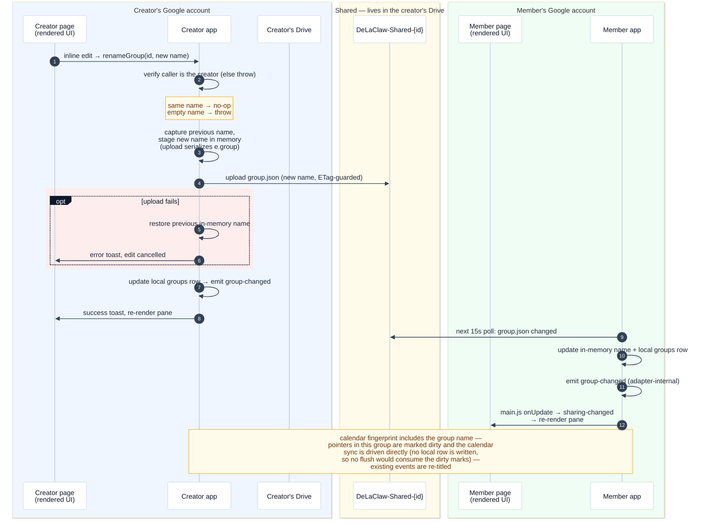
```mermaid
%%{init: {'theme': 'base', 'themeVariables': {'background': '#fbfaf8', 'actorBkg': '#ffffff', 'actorBorder': '#cbd5e1', 'actorTextColor': '#0f172a', 'actorLineColor': '#cbd5e1', 'signalColor': '#334155', 'signalTextColor': '#1e293b', 'noteBkgColor': '#fffbeb', 'noteBorderColor': '#f59e0b', 'noteTextColor': '#78350f', 'labelBoxBkgColor': '#0f172a', 'labelBoxBorderColor': '#0f172a', 'labelTextColor': '#ffffff'}}}%%
sequenceDiagram
    autonumber
    box rgb(239,246,255) Creator's Google account
    participant CP as Creator page<br/>(rendered UI)
    participant CA as Creator app
    participant CD as Creator's Drive
    end
    box rgb(255,251,235) Shared — lives in the creator's Drive
    participant SF as DeLaClaw-Shared-{id}
    end
    box rgb(240,253,244) Member's Google account
    participant MP as Member page<br/>(rendered UI)
    participant MA as Member app
    end

    CP->>CA: inline edit → renameGroup(id, new name)
    CA->>CA: verify caller is the creator (else throw)
    Note over CA: same name → no-op<br/>empty name → throw
    CA->>CA: capture previous name,<br/>stage new name in memory<br/>(upload serializes e.group)
    CA->>SF: upload group.json (new name, ETag-guarded)
    rect rgb(253, 237, 236)
    opt upload fails
        CA->>CA: restore previous in-memory name
        CA->>CP: error toast, edit cancelled
    end
    end
    CA->>CA: update local groups row → emit group-changed
    CA->>CP: success toast, re-render pane
    MA->>SF: next 15s poll: group.json changed
    MA->>MA: update in-memory name + local groups row
    MA->>MA: emit group-changed (adapter-internal)
    MA->>MP: main.js onUpdate → sharing-changed<br/>→ re-render pane
    Note over CA,MA: calendar fingerprint includes the group name —<br/>pointers in this group are marked dirty and the calendar<br/>sync is driven directly (no local row is written,<br/>so no flush would consume the dirty marks) —<br/>existing events are re-titled
```

#### Member deletes their DeLaClaw account connection (deleteAccount)

This is DeLaClaw's Drive-backed account wipe, not deletion of the Google account
itself — externally deleted Google accounts are handled manually (see below).
It runs as gated steps, in order: (1) the groups the user created are deleted —
for all their members; (2) joined groups are left, with no keep-copies dialog;
(3) the synced DeLaClaw calendar is deleted; (4) the personal `DeLaClaw/` folder
(`DeLaClawDev/` on dev and preview builds) and every file in it is permanently
deleted. If any step fails, the whole flow aborts: the account connection stays
intact and the user can retry. The OAuth token is revoked last (best effort),
then the app disconnects and reloads to the login gate.

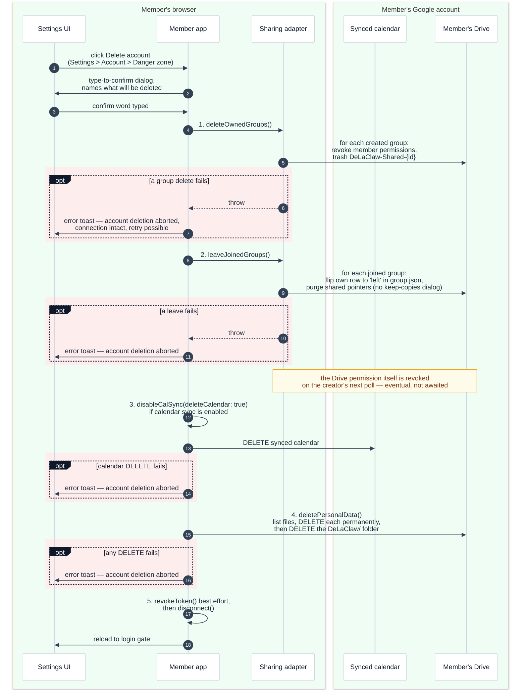
```mermaid
%%{init: {'theme': 'base', 'themeVariables': {'background': '#fbfaf8', 'actorBkg': '#ffffff', 'actorBorder': '#cbd5e1', 'actorTextColor': '#0f172a', 'actorLineColor': '#cbd5e1', 'signalColor': '#334155', 'signalTextColor': '#1e293b', 'noteBkgColor': '#fffbeb', 'noteBorderColor': '#f59e0b', 'noteTextColor': '#78350f', 'labelBoxBkgColor': '#0f172a', 'labelBoxBorderColor': '#0f172a', 'labelTextColor': '#ffffff'}}}%%
sequenceDiagram
    autonumber
    box rgb(240,253,244) Member's browser
    participant UI as Settings UI
    participant MA as Member app
    participant SH as Sharing adapter
    end
    box rgb(240,253,244) Member's Google account
    participant CAL as Synced calendar
    participant MD as Member's Drive
    end

    UI->>MA: click Delete account<br/>(Settings > Account > Danger zone)
    MA->>UI: type-to-confirm dialog,<br/>names what will be deleted
    UI->>MA: confirm word typed
    MA->>SH: 1. deleteOwnedGroups()
    SH->>MD: for each created group:<br/>revoke member permissions,<br/>trash DeLaClaw-Shared-{id}
    rect rgb(253, 237, 236)
    opt a group delete fails
        SH-->>MA: throw
        MA->>UI: error toast — account deletion aborted,<br/>connection intact, retry possible
    end
    end
    MA->>SH: 2. leaveJoinedGroups()
    SH->>MD: for each joined group:<br/>flip own row to 'left' in group.json,<br/>purge shared pointers (no keep-copies dialog)
    rect rgb(253, 237, 236)
    opt a leave fails
        SH-->>MA: throw
        MA->>UI: error toast — account deletion aborted
    end
    end
    Note over SH,MD: the Drive permission itself is revoked<br/>on the creator's next poll — eventual, not awaited
    MA->>MA: 3. disableCalSync(deleteCalendar: true)<br/>if calendar sync is enabled
    MA->>CAL: DELETE synced calendar
    rect rgb(253, 237, 236)
    opt calendar DELETE fails
        MA->>UI: error toast — account deletion aborted
    end
    end
    MA->>MD: 4. deletePersonalData()<br/>list files, DELETE each permanently,<br/>then DELETE the DeLaClaw/ folder
    rect rgb(253, 237, 236)
    opt any DELETE fails
        MA->>UI: error toast — account deletion aborted
    end
    end
    MA->>MA: 5. revokeToken() best effort,<br/>then disconnect()
    MA->>UI: reload to login gate
```

#### Externally deleted Google accounts

If a member deletes their Google account outside DeLaClaw, their Drive permission dies but their row stays in `group.json` — a ghost member. There is no detection for this: the row lingers until the creator removes it from the member list. No automatic polling or enforcement.

### Design decisions (decided 2026-09-07)

The flows above surfaced 14 design questions, all decided on 2026-09-07 and recorded in the **DeLaClaw design decisions** space ("Drive sharing" tab). Assumption: sharing is not yet exposed — no groups exist in the wild, so there are no backward-compatibility constraints (greenfield).

1. **Join notification** — the creator's poll shows a toast when a pending invitee flips to joined.
2. **Deletion sync intents** — each group entry keeps per-item-file in-memory `createdIds`/`deletedIds` intent sets; reconciliation retains pending creates, drops remotely-deleted items, and suppresses remotely-stale copies of pending deletes. Each upload acknowledges only the intents its payload represented, so an ID created mid-upload stays pending. The logic is backend-agnostic (`sharing-file-reconcile.js`), shared by all file-based adapters.
3. **leave vs unjoin** — `leaveGroup` removed; `unjoinGroup` is the only leave path. Leaving flips the member row to `status: 'left'`; the creator's poll revokes the leaver's Drive permission (owner-only) and clears the row, so leaving actually removes folder access. `left` rows are never displayed.
4. **Member IDs** — opaque hashes, never raw emails; members pick a pseudo, the hash stays immutable.
5. **Join admission** — joining requires a matching pending invite (by member ID, the hash of the joiner's email); Drive access alone is not enough.
6. **Removed members' items** — reassigned to the creator (`created_by` rewrite), no ghost creator IDs.
7. **Creator-only enforcement** — `inviteUser`/`removeUser` throw unless the caller is the creator; the invite/remove UI is hidden from non-creators.
8. **Account deletion** — superseded 2026-09-29: the wipe now runs in gated order — created groups deleted (for all members), joined groups left, synced calendar deleted, personal Drive folder permanently deleted; any step failing aborts the flow and the connection stays intact. (Was: joined groups left alone, created groups left in place, calendar deleted, personal folder trashed.)
9. **Externally deleted accounts** — no detection; ghost rows linger until the creator removes them.
10. **Placeholder exhaustion** — `extra_N.json` raised from 10 to 12 now; behavior at exhaustion deferred.
11. **Received-item placement** — always `__shared__`.
12. **Access loss** — a joined group whose folder becomes unreachable (member removed, or the group deleted) is purged: pointers deleted outright, no dialog; a toast says access was lost.
13. **No removal notice file** — removal is detected as definite access loss on the next poll (404, or 403 with a known access-loss reason). Throttled or unknown-reason 403s never purge.
14. **Group deletion** — permissions revoked and the folder trashed immediately; no deletion marker, no grace period; members purge on access loss.

## Module structure

| Module | Role |
|---|---|
| `sharing-interface.js` | Canonical method contract; validated at init |
| `sharing-envelope.js` | Invite code encode/decode (`DLC1.<base64url>`) |
| `sharing-drive.js` | Drive adapter (implements the target design) |
| `sharing-ui.js` | Settings pane, share popovers, badges, join flow |
| `sharing.js` | Factory that picks adapter by backend mode |

## Related

- [ADR 0005 — Sharing behind adapter interface](adrs/0005-sharing-behind-adapter-interface.md)
- [Setup Guide](setup.md)
- [Privacy — Google Drive scopes and data exchange](privacy.md)
