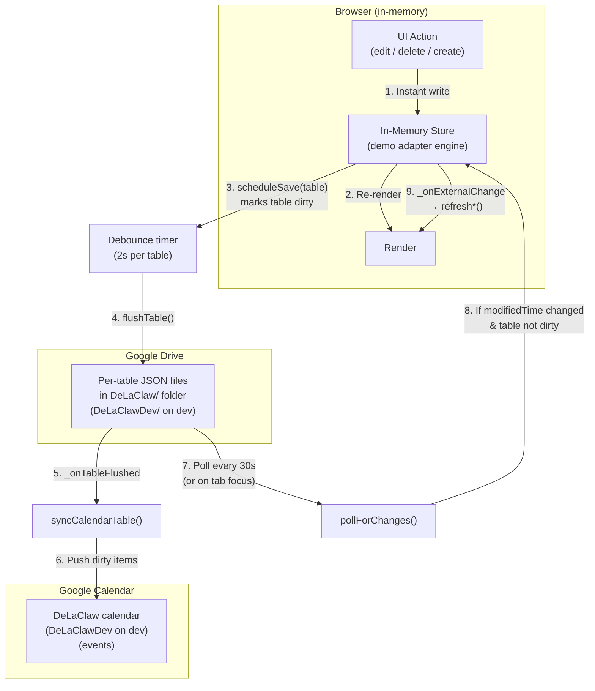
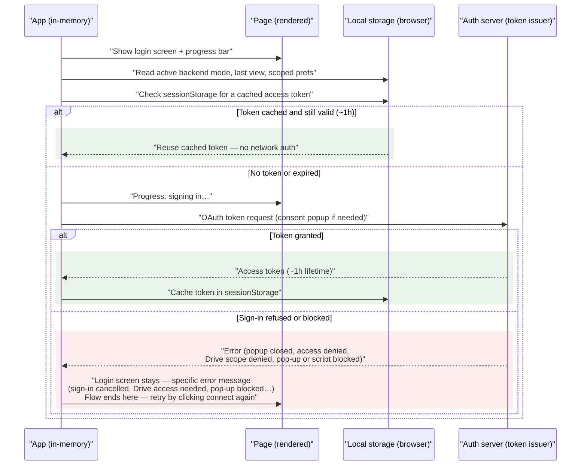
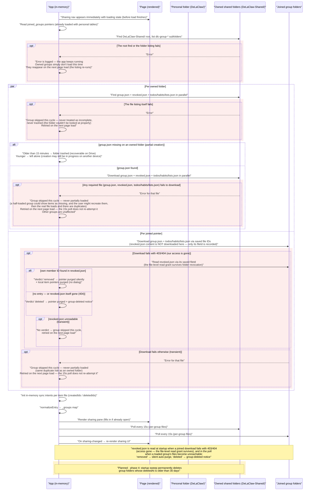
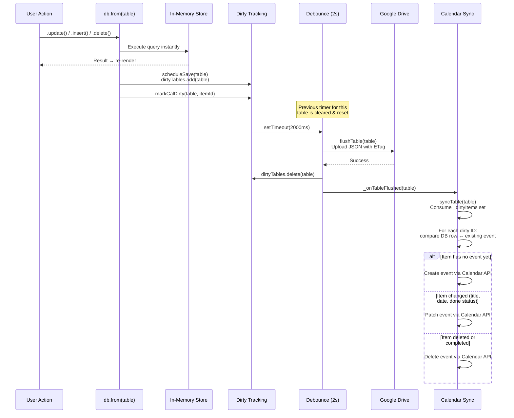
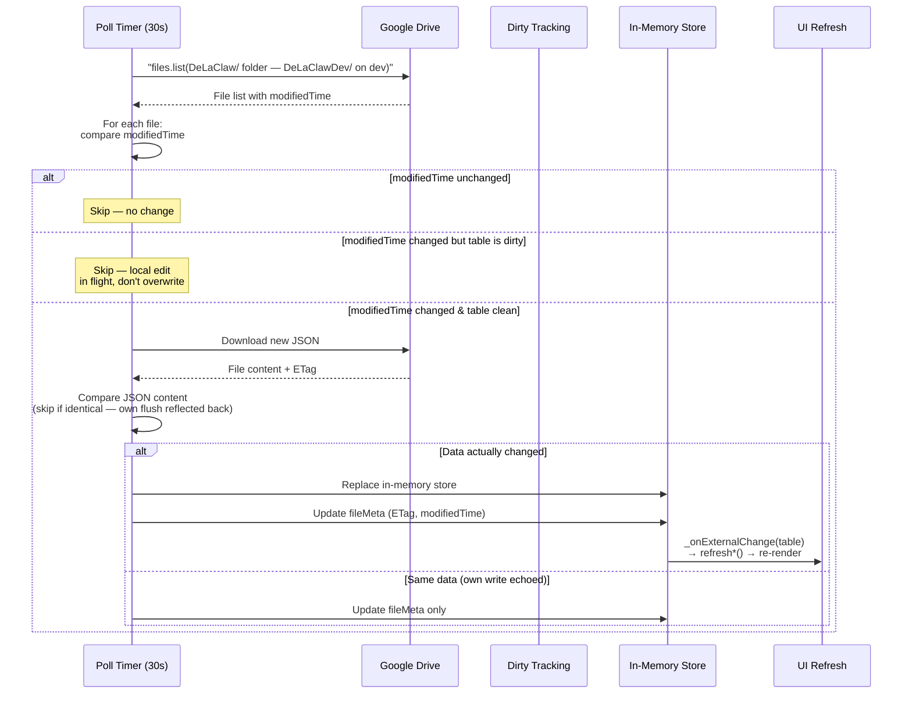
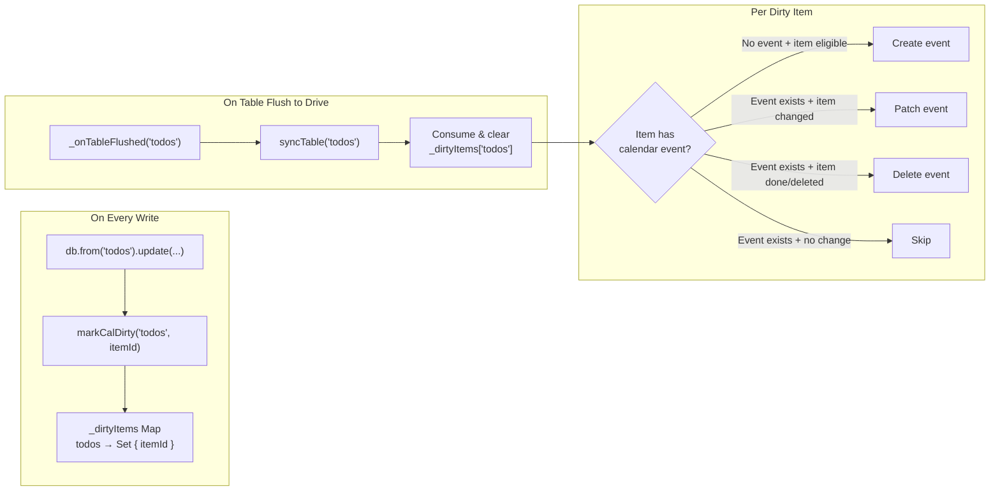
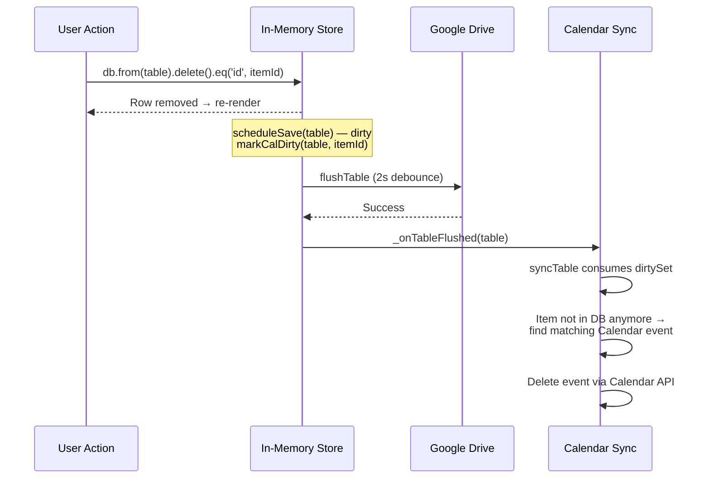

# Sync Architecture — In-Memory / Google Drive / Google Calendar

DeLaClaw's Google Drive backend is **local-first**: all reads and writes hit an in-memory store instantly. Two asynchronous layers persist and synchronize that data: **Google Drive** (durable storage) and **Google Calendar** (read-only projection of TODOs, habits, and birthdays).

## Data Flow Overview

## Startup / Connect Flow (target design — all phases)

What is fetched when the user connects, in order, drawn as columns so you can see
*where* each step reads from — including the **Page** column, which shows what is
rendered and when. Steps marked **planned** belong to phases 2–5 and are
not implemented yet; everything else is shipped on `dev`.
Names below are the Google implementation, but the shape is backend-agnostic: any
OAuth2 token issuer + file storage maps 1:1 (e.g. KDrive auth + KDrive folders).
The IndexedDB offline cache is not part of this flow — it only applies to
local-server mode, never to the Drive backend. The calendar is never read at
startup either: it is a write-only projection, synced on table flush.
**1** covers auth, **2** covers what happens at login right after auth (the
personal-data track, which loads the `joined_groups` table alongside the other
personal tables), and **3** covers the sharing startup track, which runs in
parallel with **2**. `loadAll()` reads the already-loaded pointers and runs
only in the sharing track, exactly once.

### 1 · Auth

### 2 · At login — right after auth

Once the app holds a valid access token, login runs. In order:

1. **Find-or-create the personal folder** (`DeLaClaw/`, `DeLaClawDev/` on dev).
   On failure the login screen shows a generic connection error; retrying
   re-runs find-or-create, so a folder created by a timed-out request is found
   and reused — never duplicated.
2. **List the folder's files.** This decides the branch: **existing install**
   (table files found — a retry after a failed fresh install lands here too)
   or **fresh install** (no table files at all).
3. **Existing install: download every per-table JSON file in parallel**,
   keeping each file's ETag and modifiedTime. A missing file is not a failure —
   that table simply starts empty. One failed download aborts the whole load
   (all-or-nothing) and returns to the login screen.
4. **Read `schema_version` from settings.json** (missing → version 0). If any
   migration is pending, the backup policy runs before the first one:
   - **A `backup-v{B}.json` exists for the current version** — a previous batch
     did not complete. The app downloads the backup, **replaces the in-memory
     tables with the backup's content**, then overwrites every table file in
     place from it (a table file missing from the folder is *created* from the
     backup, not overwritten). The restore is authoritative — no ETag
     preconditions — because the on-Drive state is known-bad partial-batch
     data and the backup is the source of truth. The batch then re-runs from
     the backup's version on this clean state. If the restore itself fails, the
     backup is untouched (nothing is ever deleted before success) and the retry
     restores again.
   - **No backup, or a stale one** — delete any stale backups, snapshot the
     current tables as `backup-v{currentVersion}.json`, then migrate. If the
     snapshot upload fails, nothing on Drive has changed yet.
5. **Run each pending migration, oldest first**: apply it to the in-memory
   store, bump `schema_version` in memory, upload the changed table files.
   `settings.json` is *not* written per migration. If an upload fails, the
   backup is retained and `settings.json` still carries the pre-batch version,
   so the retry restores from the backup and re-runs the whole batch.
6. **Write `settings.json` once** with the final `schema_version` — the batch
   completion marker — then **delete the backup**. A backup left on Drive always
   means "a batch did not complete".
7. **Fresh install: create one JSON file per table in parallel** (all except
   `settings.json`), seeding the category tables with their protected default
   rows — then **write `settings.json` last** with `schema_version=latest` as
   the completion marker. If the table creation fails midway, the retry lands
   in the existing-install branch with no `schema_version` (version 0), so it
   snapshots and runs all migrations — including the one that re-seeds the
   protected category rows.
8. **Create the in-memory adapter** seeded with the loaded data, hide the login
   screen, show the app shell, and render the current view from memory.
9. **Start the 30s poll and the tab-focus poll** over the personal tables. The
   calendar is never read at startup — it is a write-only projection, synced
   on table flush only.

```mermaid
sequenceDiagram
    participant App as "App (in-memory)"
    participant Page as "Page (rendered)"
    participant PF as "Personal folder (DeLaClaw/)"

    App->>Page: "Progress: connecting…"
    App->>PF: "Find-or-create DeLaClaw/ (DeLaClawDev/ on dev)"
    rect rgb(253, 237, 236)
    opt Creation or listing fails
        PF-->>App: "Error"
        App->>Page: "Login screen — generic connection error<br/>Retry re-runs find-or-create: a folder created by a timed-out request<br/>is found and reused, so no duplicate folder<br/>Flow ends here — back to the login screen"
    end
    end
    App->>PF: "List folder files"

    alt Existing install — or retry after a failed fresh install — (table files found)
        App->>PF: "Download per-table JSON files in parallel (keep ETag + modifiedTime)"
        rect rgb(253, 237, 236)
        opt A download fails
            PF-->>App: "Error"
            App->>Page: "Login screen — generic connection error<br/>All-or-nothing: one failed table aborts the whole load<br/>(a missing file is not a failure — that table just starts empty)<br/>Flow ends here — back to the login screen"
        end
        end
        PF-->>Page: "Progress: loading tables (per-table progress)"
        App->>App: "Read schema_version from settings.json"
        alt settings.json missing → version 0
            App->>App: "Every migration is pending"
        else schema_version older than latest
            App->>App: "Only migrations newer than schema_version are pending"
        else schema_version is latest
            App->>App: "Nothing pending — skip to adapter creation"
        end
        opt At least one migration is pending
            App->>App: "Look for backup-v*.json files from a previous attempt"
            alt A backup-v{B}.json exists for the current schema_version<br/>(a previous batch did not complete — settings.json is written once, at the end of the batch)
                App->>PF: "Overwrite every table file in place from the backup<br/>(never delete-then-restore)"
                rect rgb(253, 237, 236)
                opt The restore fails
                    PF-->>App: "Error"
                    App->>Page: "Login screen — generic connection error<br/>State on Drive: the backup is intact (nothing is ever deleted before success)<br/>Retry re-enters as an Existing install (branch above) → restores from the backup again<br/>Flow ends here — back to the login screen"
                end
                end
                App->>App: "Re-run the batch from the backup's version on the clean restored state"
            else No backup — or its batch completed (stale)
                App->>PF: "Delete stale backups — upload full backup of the pre-migration Drive state<br/>(backup-v{currentVersion}.json)"
                rect rgb(253, 237, 236)
                opt The backup upload fails
                    PF-->>App: "Error"
                    App->>Page: "Login screen — generic connection error<br/>State on Drive: unchanged — the backup is the first write, nothing migrated yet<br/>Retry re-enters as an Existing install (branch above)<br/>Flow ends here — back to the login screen"
                end
                end
            end
            loop For each pending migration, oldest first
                App->>App: "Apply the migration to the in-memory store,<br/>bump schema_version in memory"
                App->>PF: "Upload the changed table files (settings.json is NOT written per migration)"
                rect rgb(253, 237, 236)
                opt A migration upload fails
                    PF-->>App: "Error"
                    App->>Page: "Login screen — generic connection error<br/>State on Drive: the pre-migration backup is retained —<br/>settings.json still carries the pre-batch schema_version (it is written once, at the end)<br/>Retry re-enters as an Existing install (branch above) → restores the tables<br/>from the backup and re-runs the batch from the backup's version<br/>Flow ends here — back to the login screen"
                end
                end
            end
            App->>PF: "Write settings.json once with the final schema_version — the batch completion marker"
            App->>PF: "Delete the backup — the batch succeeded"
        end
    else Fresh install (no table files)
        App->>PF: "(1) Create one JSON file per table in parallel (all except settings.json) —<br/>seed the category tables in memory with the protected default rows<br/>and flush them to Drive"
        rect rgb(253, 237, 236)
        opt Step 1 fails
            PF-->>App: "Error"
            App->>Page: "Login screen — generic connection error<br/>State on Drive: some table files exist, settings.json does NOT exist,<br/>no schema_version stamp anywhere<br/>Retry re-enters as an Existing install (branch above)<br/>Flow ends here — back to the login screen"
        end
        end
        App->>PF: "(2) Write settings.json with schema_version=latest — the completion marker"
        rect rgb(253, 237, 236)
        opt Step 2 fails
            PF-->>App: "Error"
            App->>Page: "Login screen — generic connection error<br/>State on Drive: ALL table files exist, category tables already hold<br/>the seeded protected rows, only settings.json is missing<br/>Retry re-enters as an Existing install (branch above)<br/>Flow ends here — back to the login screen"
        end
        end
    end

    App->>App: "Create in-memory adapter seeded with loaded data"
    App->>Page: "Hide login — show app shell"
    App->>Page: "Render current view from in-memory data (welcome / todos / …)"
    App->>PF: "Start 30s poll + tab-focus poll (personal tables)"

    Note over App,Page: "Calendar is NOT synced on page load<br/>trusted already in sync, syncs on table flush only"
```

### 3 · Sharing startup

## Write Path (User Edits an Item)

## Polling Path (External Change from Another Device or Agent)

## Calendar Sync — Targeted Dirty Tracking

Calendar sync never does a full scan on every flush. Instead, it tracks which specific items changed.

**Special cases:**
- **Category rename** → `markCategoryRenamed(catTable)` marks all items of that type with `__all__` sentinel → full scan
- **Bulk operation** (null ID) → `__all__` sentinel → full scan
- **Category table flush** (e.g. `todo_categories`) → `CAT_TABLE_TO_ITEM_TABLE` maps it to the item table (`todos`) for sync
- **Settings table flush** → `TABLE_TO_TYPE` has no entry → no-op (calendar sync ignores settings changes)

## Delete Path

## Sync Bar States

The sync bar reflects the current state of Drive persistence:

| State | Meaning | Visual |
|-------|---------|--------|
| **Idle** | All changes saved | ✓ All changes saved to Drive |
| **Pending** | Debounce timer running | ● Changes waiting to sync |
| **Uploading** | Flush or poll in progress | ↻ Uploading to Drive… |
| **Error** | Flush failed (auto-retry) | ✗ Sync error — retrying |

## Edge Cases & Guards

- **Tab close / visibility hidden** → `forceSave()` fires with `keepalive: true` (skipped if payload > 64 KB)
- **Flush failure** → table stays in `dirtyTables`, `scheduleSave` retries automatically
- **ETag conflict (412)** → Drive adapter re-reads, merges by `updated_at` (newer wins per row), retries
- **Poll skips dirty tables** → prevents overwriting local edits that haven't flushed yet
- **`isEditing()` guard** → external changes don't refresh UI while user is inline-editing
- **Calendar sync disabled** → `syncTable` returns early if `prefs.enabled` is false; `_onTableFlushed` still fires but sync is a no-op
