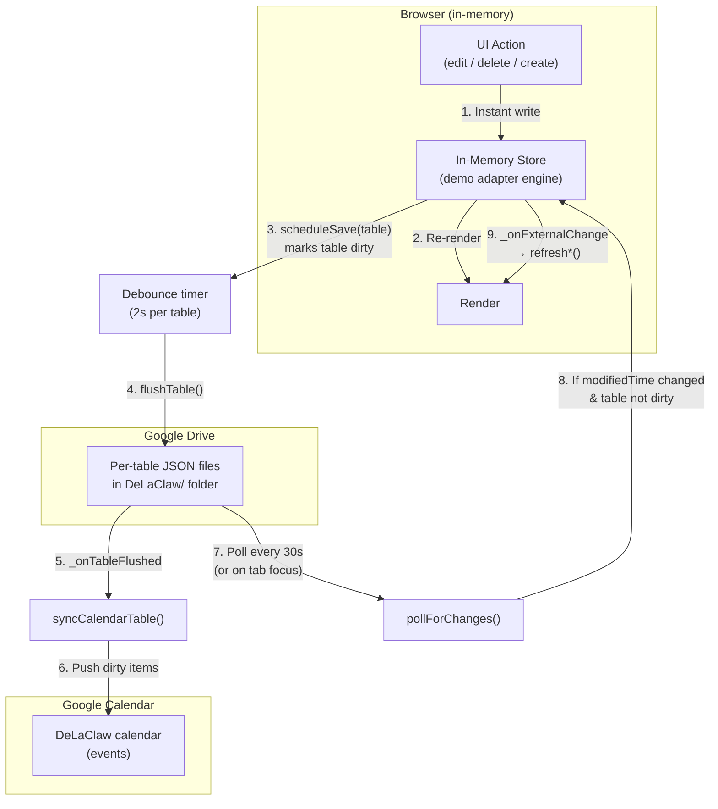
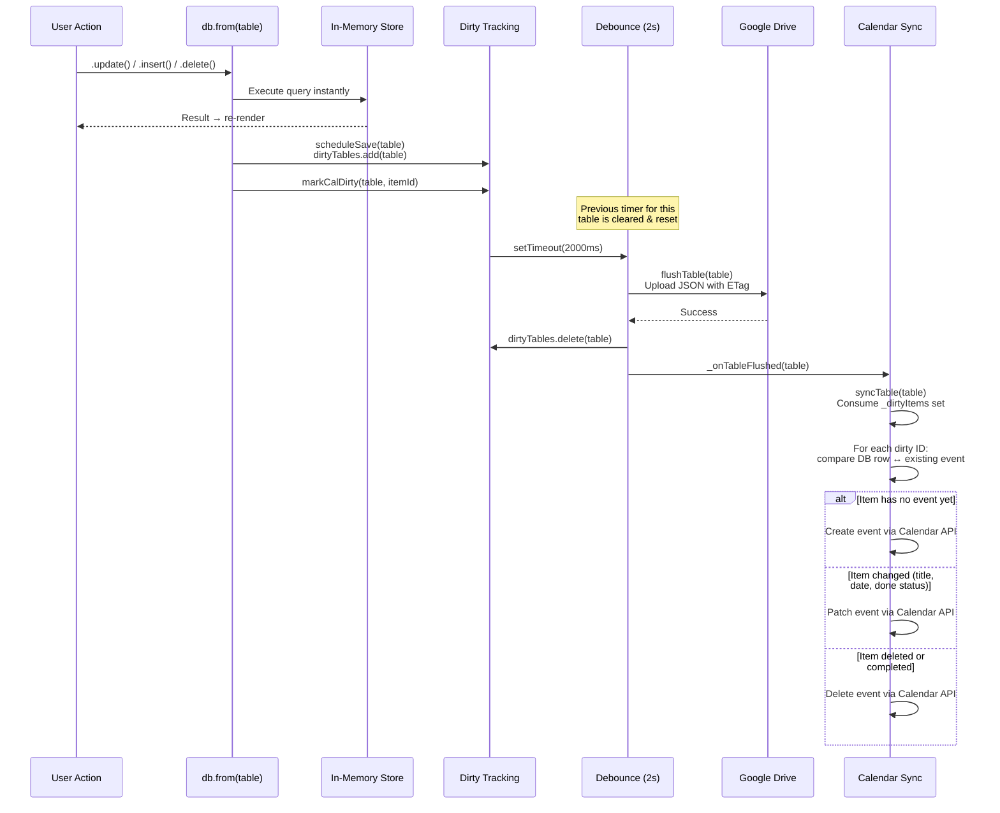
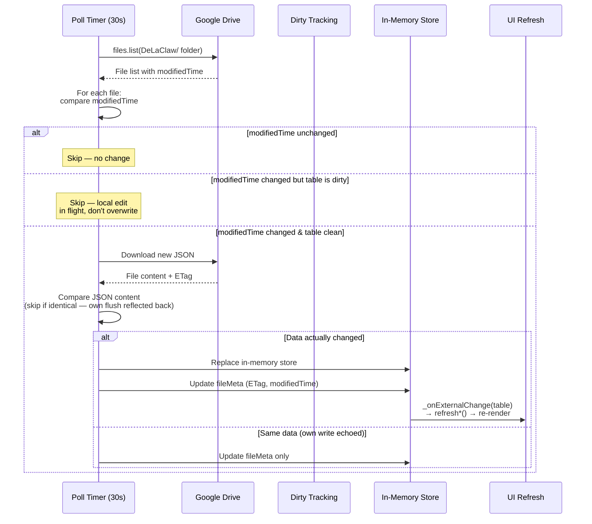
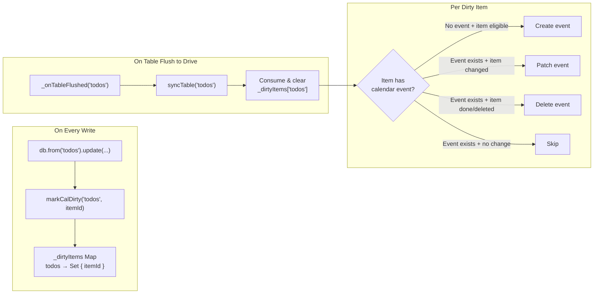
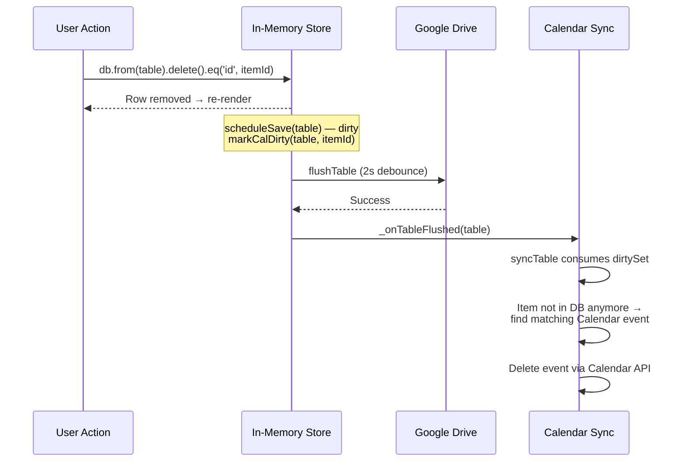

# Sync Architecture — In-Memory / Google Drive / Google Calendar

DeLaClaw's Google Drive backend is **local-first**: all reads and writes hit an in-memory store instantly. Two asynchronous layers persist and synchronize that data: **Google Drive** (durable storage) and **Google Calendar** (read-only projection of TODOs, habits, and birthdays).

## Data Flow Overview

## Write Path (User Edits an Item)

## Polling Path (External Change from Another Device or Agent)

## Calendar Sync — Targeted Dirty Tracking

Calendar sync never does a full scan on every flush. Instead, it tracks which specific items changed.

**Special cases:**
- **Category rename** → `markCategoryRenamed(catTable)` marks all items of that type with `__all__` sentinel → full scan
- **Bulk operation** (null ID) → `__all__` sentinel → full scan
- **Category table flush** (e.g. `todo_categories`) → `CAT_TABLE_TO_ITEM_TABLE` maps it to the item table (`todos`) for sync
- **Settings table flush** → `TABLE_TO_TYPE` has no entry → no-op (calendar sync ignores settings changes)

## Delete Path

## Sync Bar States

The sync bar reflects the current state of Drive persistence:

| State | Meaning | Visual |
|-------|---------|--------|
| **Idle** | All changes saved | ✓ All changes saved to Drive |
| **Pending** | Debounce timer running | ● Changes waiting to sync |
| **Uploading** | Flush or poll in progress | ↻ Uploading to Drive… |
| **Error** | Flush failed (auto-retry) | ✗ Sync error — retrying |

## Edge Cases & Guards

- **Tab close / visibility hidden** → `forceSave()` fires with `keepalive: true` (skipped if payload > 64 KB)
- **Flush failure** → table stays in `dirtyTables`, `scheduleSave` retries automatically
- **ETag conflict (412)** → Drive adapter re-reads, merges by `updated_at` (newer wins per row), retries
- **Poll skips dirty tables** → prevents overwriting local edits that haven't flushed yet
- **`isEditing()` guard** → external changes don't refresh UI while user is inline-editing
- **Calendar sync disabled** → `syncTable` returns early if `prefs.enabled` is false; `_onTableFlushed` still fires but sync is a no-op
